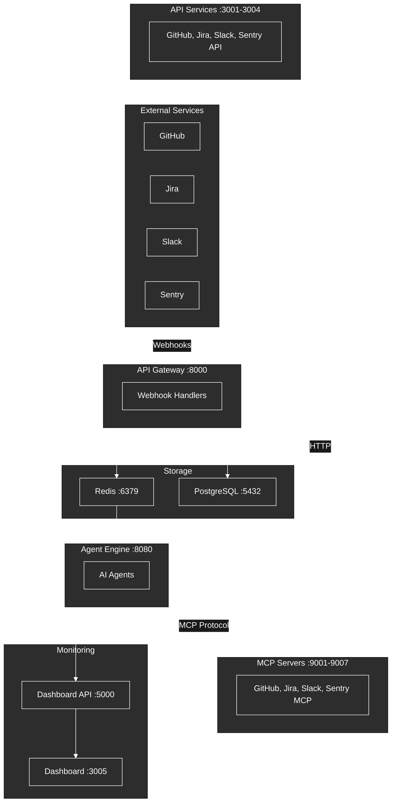

# Groote AI

A containerized multi-agent system that processes webhooks from GitHub, Jira, Slack, and Sentry to autonomously handle development tasks using AI agents (Claude Code CLI or Cursor CLI) with Test-Driven Development methodology.

## System Overview



**How it works:**

1. External services (GitHub, Jira, Slack, Sentry) send webhooks to the API Gateway
2. API Gateway validates signatures and enqueues tasks to Redis
3. Agent Engine picks up tasks and executes them using Claude or Cursor CLI
4. Agents use MCP tools to interact with external services
5. Results are posted back to the originating service

## Quick Start

```bash
# 1. Clone and initialize
git clone <repository-url>
cd groote-ai
make init

# 2. Configure environment (minimum: ANTHROPIC_API_KEY)
nano .env

# 3. Start all services
make up

# 4. Start AI agent CLI
make cli-claude    # or: make cli-cursor

# 5. Verify health
make health
```

**Access points:**
- API Gateway: http://localhost:8000
- Dashboard UI: http://localhost:3005
- Dashboard API: http://localhost:5000

For detailed setup instructions, see **[SETUP.md](SETUP.md)**.

## Task Flow


## Key Commands

### CLI Management

```bash
make cli-claude              # Start Claude CLI
make cli-cursor              # Start Cursor CLI
make cli-up PROVIDER=claude SCALE=3  # Scale CLI instances
make cli-down PROVIDER=claude        # Stop CLI
make cli-logs PROVIDER=claude        # View CLI logs
make cli-status PROVIDER=claude      # Check CLI status
```

### Service Management

```bash
make up                      # Start all services
make down                    # Stop all services
make health                  # Check service health
make logs                    # View all logs
```

### Development

```bash
make init                    # Initialize project
make test                    # Run all tests
make lint                    # Lint code
make format                  # Format code
make db-migrate MSG="..."    # Create migration
make db-upgrade              # Apply migrations
```

## Services Overview

| Service | Port | Purpose |
|---------|------|---------|
| **Agent Engine** | 8080-8089 | Task execution (scalable) |
| **API Gateway** | 8000 | Webhook reception |
| **Dashboard API** | 5000 | Analytics & WebSocket |
| **Dashboard UI** | 3005 | React monitoring UI |
| **MCP Servers** | 9001-9007 | Tool interfaces |
| **API Services** | 3001-3004 | REST API wrappers |
| **Redis** | 6379 | Task queue & cache |
| **PostgreSQL** | 5432 | Persistent storage |

## Environment Variables

Minimum required configuration in `.env`:

```bash
# CLI Provider (choose one)
CLI_PROVIDER=claude
ANTHROPIC_API_KEY=sk-ant-xxx   # For Claude
# CURSOR_API_KEY=xxx           # For Cursor

# External Services (configure as needed)
GITHUB_TOKEN=ghp_xxx
GITHUB_WEBHOOK_SECRET=xxx
JIRA_URL=https://yourcompany.atlassian.net
JIRA_API_TOKEN=xxx
SLACK_BOT_TOKEN=xoxb-xxx
SENTRY_DSN=https://xxx@sentry.io/xxx
```

See `.env.example` for complete configuration.

## Health Checks

```bash
curl http://localhost:8000/health   # API Gateway
curl http://localhost:8080/health   # Agent Engine
curl http://localhost:5000/health   # Dashboard API
```

## Project Structure

```
groote-ai/
├── agent-engine/       # CLI task execution engine
├── api-gateway/        # Webhook reception
├── api-services/       # REST API wrappers (credentials here)
├── dashboard-api/      # Analytics & WebSocket hub
├── external-dashboard/ # React monitoring UI
├── mcp-servers/        # MCP protocol servers
├── oauth-service/      # OAuth flows
├── task-logger/        # Task output logging
├── docs/               # Documentation
├── docker-compose.yml  # Service orchestration
├── Makefile            # Development commands
└── SETUP.md            # Setup guide
```

## Documentation

### Getting Started

- **[SETUP.md](SETUP.md)** - Complete setup guide (start here)
- **[docs/ARCHITECTURE.md](docs/ARCHITECTURE.md)** - System architecture, diagrams, data flows

### Service Documentation

Each service has its own setup and documentation:

| Service | Setup Guide | README |
|---------|-------------|--------|
| Agent Engine | [SETUP.md](agent-engine/SETUP.md) | [README.md](agent-engine/README.md) |
| API Gateway | [SETUP.md](api-gateway/SETUP.md) | [README.md](api-gateway/README.md) |
| Dashboard API | [SETUP.md](dashboard-api/SETUP.md) | [README.md](dashboard-api/README.md) |
| Dashboard UI | [SETUP.md](external-dashboard/SETUP.md) | [README.md](external-dashboard/README.md) |
| MCP Servers | [SETUP.md](mcp-servers/SETUP.md) | [README.md](mcp-servers/README.md) |
| API Services | [SETUP.md](api-services/SETUP.md) | [README.md](api-services/README.md) |
| OAuth Service | [SETUP.md](oauth-service/SETUP.md) | [README.md](oauth-service/README.md) |

### Development

- **[CLAUDE.md](.claude/CLAUDE.md)** - Development rules and coding standards
- **[docs/INTEGRATION-IMPLEMENTATION-PLAN.md](docs/INTEGRATION-IMPLEMENTATION-PLAN.md)** - Integration guide

## Optional: Knowledge Services

The system includes an optional knowledge layer for enhanced code search and semantic retrieval. Enable with:

```bash
docker-compose --profile knowledge up -d
```

See [docs/SETUP-KNOWLEDGE.md](docs/SETUP-KNOWLEDGE.md) for details.

## License

[Add your license information here]

## Contributing

[Add contributing guidelines here]
