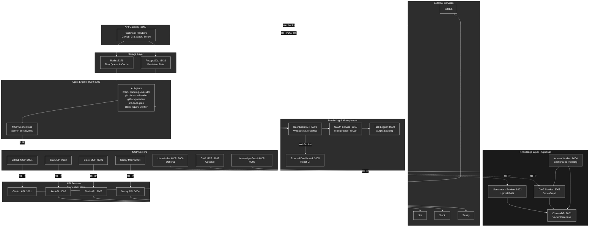
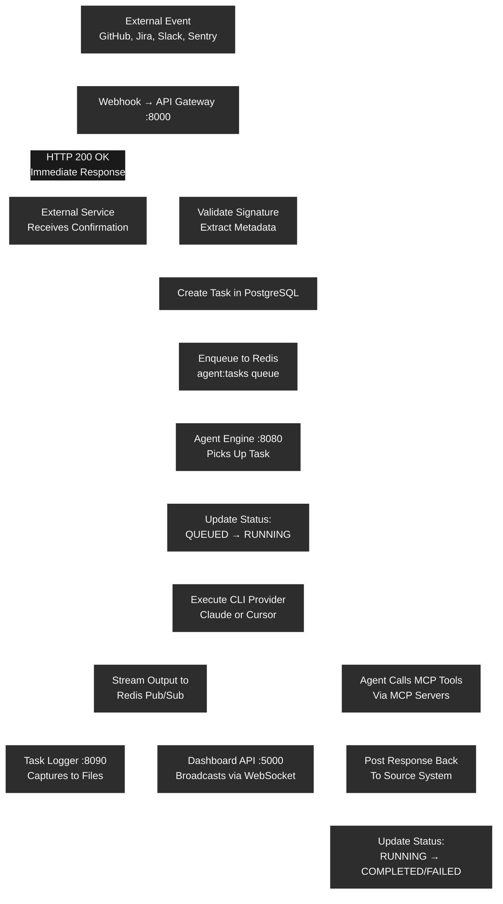
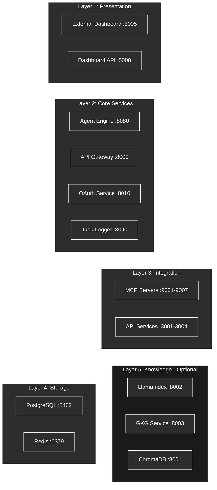

# Groote AI

A containerized multi-agent system that processes webhooks from GitHub, Jira, Slack, and Sentry to autonomously handle development tasks using AI agents (Claude Code CLI or Cursor CLI) with Test-Driven Development methodology.

## Architecture



## Task Lifecycle



## How It Works

### System Flow

1. **Webhook Reception**: External services (GitHub, Jira, Slack, Sentry) send webhooks to the API Gateway
2. **Validation & Queuing**: API Gateway validates signatures, creates task in PostgreSQL, and enqueues to Redis
3. **Task Pickup**: Agent Engine picks up task from Redis queue (`agent:tasks`)
4. **CLI Execution**: Agent Engine executes task using Claude or Cursor CLI with specialized agents
5. **MCP Tool Calls**: Agents use MCP tools (via SSE) to interact with external services
6. **Response Posting**: Results are posted back to the originating service
7. **Real-time Updates**: Output streams to Dashboard via WebSocket

### Layer Architecture



### Key Design Principles

- **Service Isolation**: Each service runs in its own Docker container
- **Credential Security**: API keys only stored in API service containers
- **Async Processing**: Webhooks respond immediately (HTTP 200), tasks processed asynchronously
- **Horizontal Scaling**: Agent Engine can scale to multiple instances
- **No Direct Imports**: Services communicate via API/Queue only

## Quick Start

```bash
# 1. Clone and initialize
git clone <repository-url>
cd groote-ai
make init

# 2. Set bootstrap secrets (only 2-3 vars needed)
#    Edit .env and set: POSTGRES_PASSWORD, TOKEN_ENCRYPTION_KEY
nano .env

# 3. Build and start all services
make up

# 4. Open the Setup Wizard — configures everything else via UI
#    (Dashboard auto-redirects here on first launch)
open http://localhost:3005/setup

# 5. Start the AI agent CLI
make cli-claude    # or: make cli-cursor

# 6. Verify everything is running
make health
```

### Setup Wizard

On first launch the Dashboard redirects to a guided **Setup Wizard** at `/setup`.
The wizard walks through each integration step-by-step:

1. **Infrastructure Check** — verifies PostgreSQL and Redis are healthy
2. **AI Provider** — configure Claude or Cursor API key
3. **GitHub / Jira / Slack / Sentry** — optional, each can be skipped
4. **Review & Export** — download config as `.env`, Kubernetes Secret, Docker Swarm secrets, or GitHub Actions format

All credentials are Fernet-encrypted at rest in PostgreSQL. You can reconfigure
anytime from **Settings** in the sidebar.

**Access points:**
- API Gateway: http://localhost:8000
- Dashboard UI: http://localhost:3005
- Dashboard API: http://localhost:5000

For detailed setup instructions, see **[SETUP.md](SETUP.md)**.

## Services

### Core Services

| Service | Port | Purpose |
|---------|------|---------|
| **Agent Engine (CLI)** | 8080-8089 | Task execution using Claude/Cursor CLI (scalable) |
| **API Gateway** | 8000 | Webhook reception and validation |
| **Dashboard API** | 5000 | Analytics, WebSocket hub for real-time updates |
| **External Dashboard** | 3005 | React monitoring UI |
| **OAuth Service** | 8010 | Multi-provider OAuth flows (GitHub, Jira, Slack) |
| **Task Logger** | 8090 | Task output logging to files |
| **Knowledge Graph** | 4000 | Code entity indexing (Rust) |

### MCP Servers (Tool Interfaces)

| Service | Port | Purpose |
|---------|------|---------|
| **GitHub MCP** | 9001 | GitHub operations (PRs, issues, comments) |
| **Jira MCP** | 9002 | Jira operations (tickets, transitions) |
| **Slack MCP** | 9003 | Slack messaging and channels |
| **Sentry MCP** | 9004 | Sentry error tracking |
| **Knowledge Graph MCP** | 9005 | Code search and references |
| **LlamaIndex MCP** | 9006 | Hybrid search (optional) |
| **GKG MCP** | 9007 | Code graph queries (optional) |

### API Services (Credentials Here)

| Service | Port | Purpose |
|---------|------|---------|
| **GitHub API** | 3001 | GitHub REST API wrapper |
| **Jira API** | 3002 | Jira REST API wrapper |
| **Slack API** | 3003 | Slack REST API wrapper |
| **Sentry API** | 3004 | Sentry REST API wrapper |

### Storage

| Service | Port | Purpose |
|---------|------|---------|
| **Redis** | 6379 | Task queue (`agent:tasks`) and cache |
| **PostgreSQL** | 5432 | Persistent storage (tasks, OAuth tokens, analytics) |

### Knowledge Layer (Optional)

| Service | Port | Purpose |
|---------|------|---------|
| **ChromaDB** | 8001 | Vector database for embeddings |
| **LlamaIndex Service** | 8002 | Hybrid RAG orchestration |
| **GKG Service** | 8003 | Code relationship graph |
| **Indexer Worker** | 8004 | Background data source indexing |

## Key Commands

### CLI Management

```bash
make cli-claude                      # Start Claude CLI
make cli-cursor                      # Start Cursor CLI
make cli PROVIDER=claude SCALE=3     # Scale CLI instances
make cli-down PROVIDER=claude        # Stop CLI
make cli-logs PROVIDER=claude        # View CLI logs
```

### Service Management

```bash
make up                              # Start all services
make down                            # Stop all services
make health                          # Check service health
make logs                            # View all logs
```

### Development

```bash
make init                            # Initialize project
make test                            # Run all tests
make lint                            # Lint code
make format                          # Format code
make db-migrate MSG="..."            # Create migration
make db-upgrade                      # Apply migrations
```

### Knowledge Services (Optional)

```bash
docker-compose --profile knowledge up -d  # Enable knowledge layer
make knowledge-up                         # Alternative command
```

## Environment Variables

Minimum required configuration in `.env`:

```bash
# CLI Provider (choose one)
CLI_PROVIDER=claude
ANTHROPIC_API_KEY=sk-ant-xxx         # For Claude
# CURSOR_API_KEY=xxx                 # For Cursor

# Database (defaults work for local dev)
POSTGRES_PASSWORD=agent
REDIS_URL=redis://redis:6379/0

# External Services (configure as needed)
GITHUB_TOKEN=ghp_xxx
GITHUB_WEBHOOK_SECRET=xxx
JIRA_URL=https://yourcompany.atlassian.net
JIRA_EMAIL=your-email@company.com
JIRA_API_TOKEN=xxx
SLACK_BOT_TOKEN=xoxb-xxx
SLACK_SIGNING_SECRET=xxx
SENTRY_DSN=https://xxx@sentry.io/xxx
SENTRY_AUTH_TOKEN=xxx
```

See `.env.example` for complete configuration.

## Health Checks

```bash
curl http://localhost:8000/health    # API Gateway
curl http://localhost:8080/health    # Agent Engine
curl http://localhost:5000/health    # Dashboard API
curl http://localhost:8010/health    # OAuth Service
curl http://localhost:8090/health    # Task Logger
curl http://localhost:4000/health    # Knowledge Graph
```

## Project Structure

```
groote-ai/
├── agent-engine/           # CLI task execution engine
│   └── .claude/agents/     # 13 specialized agents
│   └── .claude/skills/     # 9 reusable skills
├── api-gateway/            # Webhook reception
├── api-services/           # REST API wrappers (credentials here)
│   ├── github-api/
│   ├── jira-api/
│   ├── slack-api/
│   └── sentry-api/
├── mcp-servers/            # MCP protocol servers
│   ├── github-mcp/
│   ├── jira-mcp/
│   ├── slack-mcp/
│   ├── sentry-mcp/
│   ├── knowledge-graph-mcp/
│   ├── llamaindex-mcp/     # Optional
│   └── gkg-mcp/            # Optional
├── dashboard-api/          # Analytics & WebSocket hub
├── external-dashboard/     # React monitoring UI
├── oauth-service/          # OAuth flows
├── task-logger/            # Task output logging
├── knowledge-graph/        # Code entity indexing (Rust)
├── llamaindex-service/     # Hybrid RAG (optional)
├── gkg-service/            # Code graph (optional)
├── indexer-worker/         # Background indexing (optional)
├── docs/                   # Documentation
│   └── ARCHITECTURE.md     # Detailed architecture
├── docker-compose.yml      # Service orchestration
├── Makefile                # Development commands
├── SETUP.md                # Setup guide
└── .env.example            # Environment template
```

## Documentation

### Getting Started

| Document | Description |
|----------|-------------|
| **[SETUP.md](SETUP.md)** | Complete setup guide - start here |
| **[docs/ARCHITECTURE.md](docs/ARCHITECTURE.md)** | Detailed architecture, data flows, service interactions |
| **[.claude/CLAUDE.md](.claude/CLAUDE.md)** | Development rules and coding standards |

### Service Documentation

Each service has its own setup guide and README:

| Service | Setup | README |
|---------|-------|--------|
| Agent Engine | [SETUP.md](agent-engine/SETUP.md) | [README.md](agent-engine/README.md) |
| API Gateway | [SETUP.md](api-gateway/SETUP.md) | [README.md](api-gateway/README.md) |
| Dashboard API | [SETUP.md](dashboard-api/SETUP.md) | [README.md](dashboard-api/README.md) |
| External Dashboard | [SETUP.md](external-dashboard/SETUP.md) | [README.md](external-dashboard/README.md) |
| MCP Servers | [SETUP.md](mcp-servers/SETUP.md) | [README.md](mcp-servers/README.md) |
| API Services | [SETUP.md](api-services/SETUP.md) | [README.md](api-services/README.md) |
| OAuth Service | [SETUP.md](oauth-service/SETUP.md) | [README.md](oauth-service/README.md) |
| Knowledge Layer | [SETUP-KNOWLEDGE.md](docs/SETUP-KNOWLEDGE.md) | - |

## Key Components

### Agents

The system includes **13 specialized agents**:
- `brain` - Main orchestrator
- `planning` - Discovery and planning
- `executor` - TDD implementation
- `verifier` - Quality assurance
- `github-issue-handler` - GitHub issue processing
- `github-pr-review` - PR review handling
- `jira-code-plan` - Jira ticket handling
- `slack-inquiry` - Slack Q&A
- And more...

### Skills

**9 reusable skills** for agents:
- Discovery, Testing, Code Refactoring
- GitHub/Jira/Slack Operations
- Human Approval, Verification, Knowledge Graph

### Security Model

- **Credential Isolation**: API keys only in API service containers
- **Webhook Validation**: HMAC-SHA256 signature validation
- **Loop Prevention**: Agent-posted content tracked in Redis
- **No Direct Imports**: Services communicate via API/Queue only

## License

[Add your license information here]

## Contributing

[Add contributing guidelines here]
