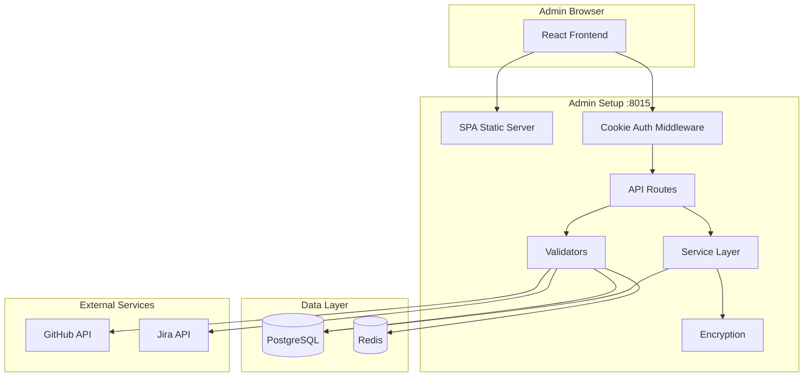
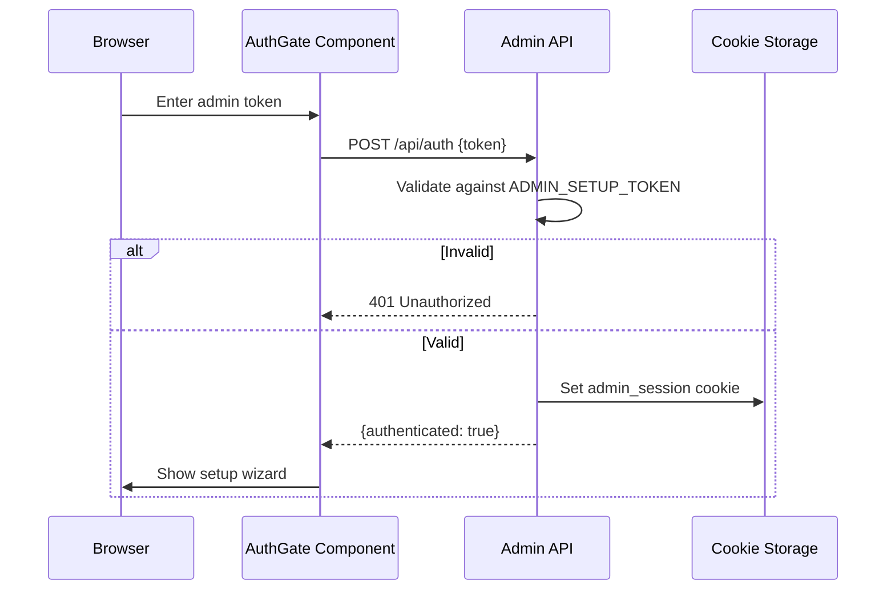
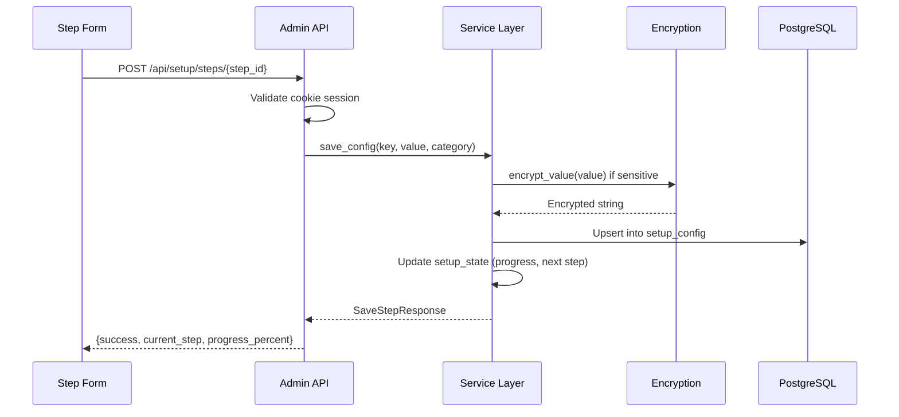

# Admin Setup Architecture

## Overview

The Admin Setup service is a first-run configuration tool for groote-ai. It provides a token-authenticated web interface for administrators to configure OAuth app credentials for GitHub, Jira, and Slack, verify infrastructure health, and export environment configuration.

## Design Principles

1. **Token Authentication** - All admin endpoints protected by `ADMIN_SETUP_TOKEN` via cookie-based sessions
2. **Encrypted Storage** - Sensitive credentials encrypted with Fernet symmetric encryption before database storage
3. **Step-Based Wizard** - Multi-step setup flow with progress tracking, skip support, and validation
4. **SPA Serving** - FastAPI serves the React frontend build as static files with SPA fallback routing

## Component Architecture



## Directory Structure

```
admin-setup/
├── src/
│   ├── main.py              # FastAPI app, lifespan, SPA serving
│   ├── routes.py            # API router (12 endpoints)
│   ├── service.py           # Business logic (setup state, config CRUD)
│   ├── models.py            # Pydantic request/response models
│   ├── config.py            # Settings via pydantic-settings
│   ├── db.py                # SQLAlchemy models and engine init
│   ├── validators.py        # Infrastructure and credential validation
│   └── encryption.py        # Fernet encrypt/decrypt helpers
├── frontend/
│   ├── src/
│   │   ├── App.tsx           # React app root
│   │   ├── main.tsx          # Entry point
│   │   ├── components/
│   │   │   ├── AuthGate.tsx      # Token authentication gate
│   │   │   ├── DashboardView.tsx # Setup wizard container
│   │   │   ├── Layout.tsx        # Page layout
│   │   │   ├── ServiceCard.tsx   # Service health card
│   │   │   └── StepIndicator.tsx # Step progress indicator
│   │   └── steps/
│   │       ├── WelcomeStep.tsx   # Welcome and prerequisites
│   │       ├── ServiceStep.tsx   # Service configuration form
│   │       └── ReviewStep.tsx    # Configuration review
│   └── package.json
├── requirements.txt
└── Dockerfile
```

## Data Flow

### Authentication Flow



### Configuration Save Flow



## Database Tables

### setup_state

| Column | Type | Description |
|--------|------|-------------|
| id | String(50) | Primary key (always "admin") |
| is_complete | Boolean | Setup completion flag |
| current_step | String(50) | Current wizard step |
| completed_steps | Text (JSON) | List of completed step IDs |
| skipped_steps | Text (JSON) | List of skipped step IDs |
| progress_percent | Float | Completion percentage |
| started_at | DateTime | Setup start timestamp |
| completed_at | DateTime | Setup completion timestamp |

### setup_config

| Column | Type | Description |
|--------|------|-------------|
| key | String(255) | Config key (primary key) |
| value | Text | Plain or encrypted value |
| category | String(50) | Category (domain, github, jira, slack) |
| is_sensitive | Boolean | Whether value is encrypted |
| display_name | String(255) | Human-readable label |
| updated_at | DateTime | Last update timestamp |
| scope | String(20) | Always "admin" for this service |

## Setup Steps

| Step ID | Category | Config Keys |
|---------|----------|-------------|
| welcome | - | No config (intro step) |
| public_url | domain | PUBLIC_URL |
| github | github | GITHUB_APP_ID, GITHUB_APP_NAME, GITHUB_CLIENT_ID, GITHUB_CLIENT_SECRET, GITHUB_PRIVATE_KEY_FILE, GITHUB_WEBHOOK_SECRET |
| jira | jira | JIRA_CLIENT_ID, JIRA_CLIENT_SECRET, JIRA_SITE_URL |
| slack | slack | SLACK_CLIENT_ID, SLACK_CLIENT_SECRET, SLACK_SIGNING_SECRET, SLACK_STATE_SECRET |
| review | - | No config (review step) |

## Integration Points

### With Other Services (Post-Setup)
```
Admin Setup -> Stores credentials in PostgreSQL
Other Services -> Read credentials from PostgreSQL at runtime
```

### Validation Endpoints
```
Admin Setup -> GitHub API (verify App ID + private key)
Admin Setup -> Jira API (verify site reachability)
Admin Setup -> PostgreSQL (health check)
Admin Setup -> Redis (health check)
```

## Testing Strategy

Tests focus on **behavior**, not implementation:
- "Authentication with valid token sets session cookie"
- "Saving a step encrypts sensitive values"
- "Infrastructure check reports PostgreSQL and Redis status"
- "Export generates valid .env content"
