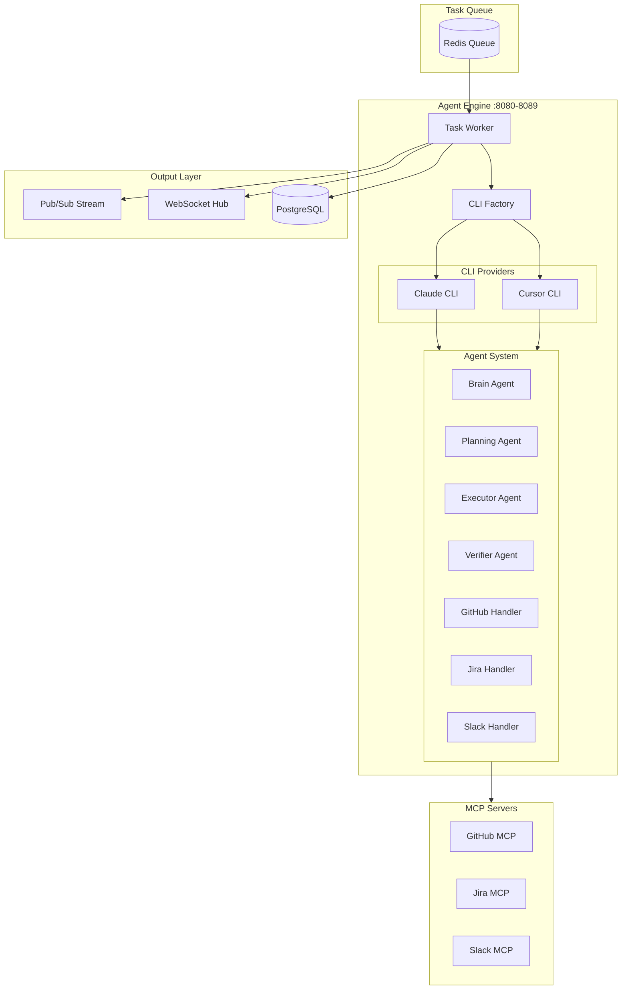
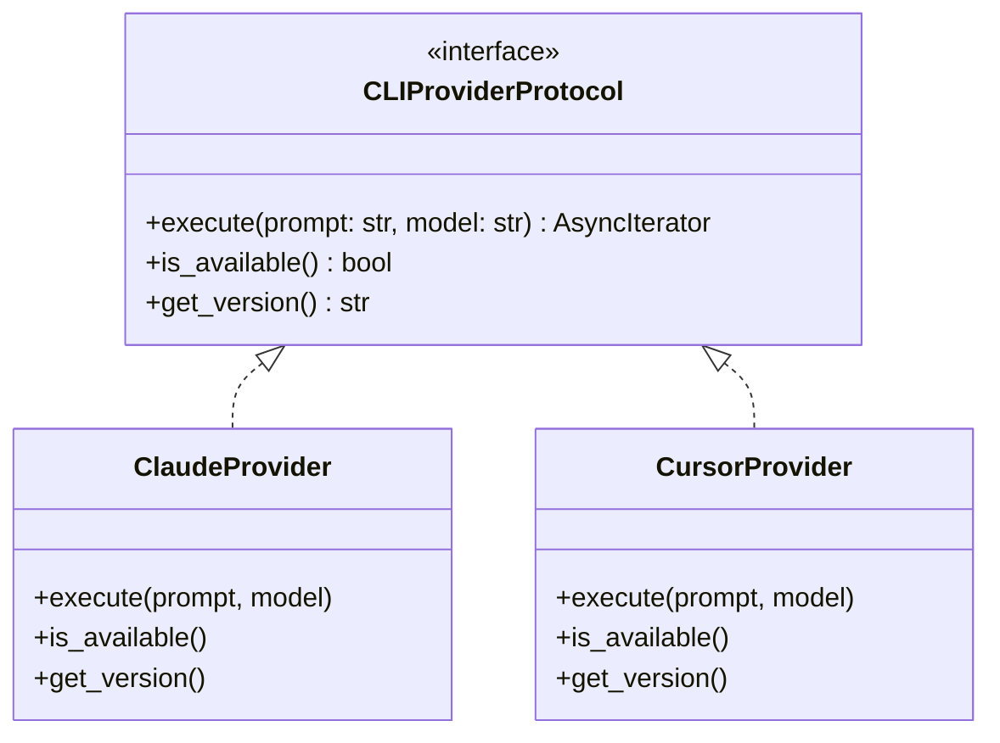
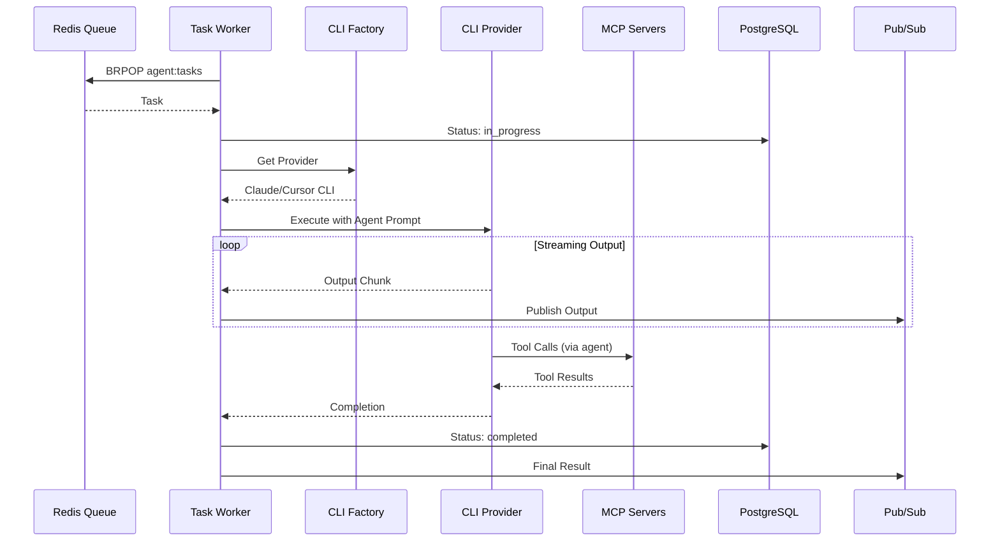
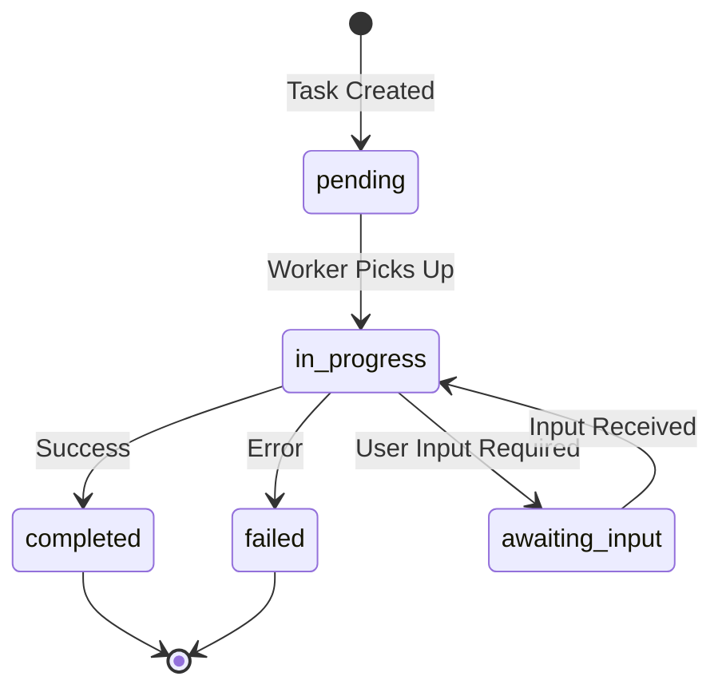
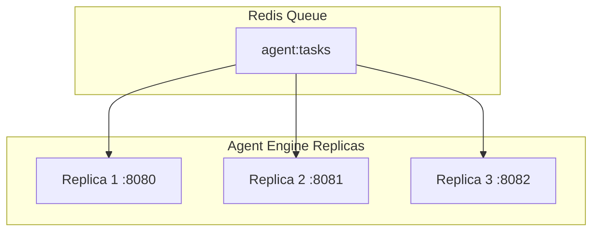

# Agent Engine Architecture

## Overview

The Agent Engine is a scalable task execution engine with multi-CLI provider support. It consumes tasks from Redis queue, executes them using CLI providers (Claude/Cursor), orchestrates 13 specialized agents, and posts results back to sources.

## Design Principles

1. **Provider Agnostic** - Abstract CLI interface supports multiple providers
2. **Horizontal Scaling** - Multiple replicas consume from shared queue
3. **Agent Specialization** - 13 agents optimized for specific task types
4. **Real-Time Streaming** - Output streamed to Redis Pub/Sub and WebSocket

## Component Architecture



## Directory Structure

```
agent-engine/
├── main.py                    # FastAPI app + task worker
├── cli/
│   ├── base.py                # CLIProvider protocol
│   ├── factory.py             # Provider factory
│   ├── sanitization.py        # Output sanitization
│   └── providers/
│       ├── claude.py          # Claude CLI provider
│       └── cursor.py          # Cursor CLI provider
├── services/
│   └── knowledge.py           # Knowledge service integration
├── config/
│   └── settings.py            # Configuration
├── .claude/
│   ├── agents/                # 13 agent definitions
│   │   ├── brain.md
│   │   ├── planning.md
│   │   ├── executor.md
│   │   ├── verifier.md
│   │   ├── github-issue-handler.md
│   │   ├── github-pr-review.md
│   │   ├── jira-code-plan.md
│   │   ├── slack-inquiry.md
│   │   ├── service-integrator.md
│   │   ├── self-improvement.md
│   │   ├── agent-creator.md
│   │   ├── skill-creator.md
│   │   └── webhook-generator.md
│   ├── skills/                # 9 skill definitions
│   └── CLAUDE.md              # Agent orchestration config
├── mcp.json                   # MCP server connections
└── tests/
    ├── factories/             # Test data factories
    ├── conftest.py            # Shared fixtures
    └── test_*.py              # Test files
```

## CLI Provider Protocol



## Data Flow

### Task Execution Flow



## Agent System

### Core Agents (Orchestration)

| Agent | Model | Purpose |
|-------|-------|---------|
| brain | opus | Central orchestrator, delegates to specialists |
| planning | opus | Discovery + PLAN.md creation |
| executor | sonnet | TDD implementation |
| verifier | opus | Quality verification |

### Workflow Agents (Source-Specific)

| Agent | Trigger | Purpose |
|-------|---------|---------|
| github-issue-handler | GitHub issues/comments | Handle GitHub issues |
| github-pr-review | Pull requests | Review PRs |
| jira-code-plan | Jira tickets | Plan Jira work |
| slack-inquiry | Slack mentions | Answer Slack questions |

### Support Agents

| Agent | Purpose |
|-------|---------|
| service-integrator | External service coordination |
| self-improvement | Memory + learning |
| agent-creator | Dynamic agent generation |
| skill-creator | Dynamic skill generation |
| webhook-generator | Webhook configuration |

## Task State Machine



## Scaling Model



Each replica:
- Independently consumes from shared queue
- Has its own CLI process
- Logs health to PostgreSQL

## Testing Strategy

Tests focus on **behavior**, not implementation:

- ✅ "Task transitions from pending to in_progress"
- ✅ "Claude provider selected when CLI_PROVIDER=claude"
- ✅ "Output streamed to Pub/Sub"
- ❌ "subprocess.Popen called with correct arguments"

## Integration Points

### With API Gateway
```
API Gateway → LPUSH agent:tasks → Agent Engine
```

### With MCP Servers
```json
{
  "mcpServers": {
    "github": {"url": "http://github-mcp:9001/sse"},
    "jira": {"url": "http://jira-mcp:9002/sse"},
    "slack": {"url": "http://slack-mcp:9003/sse"},
    "sentry": {"url": "http://sentry-mcp:9004/sse"}
  }
}
```

### With API Services (Response Posting)
```
Agent Engine → github-api → GitHub
Agent Engine → jira-api → Jira
Agent Engine → slack-api → Slack
```
