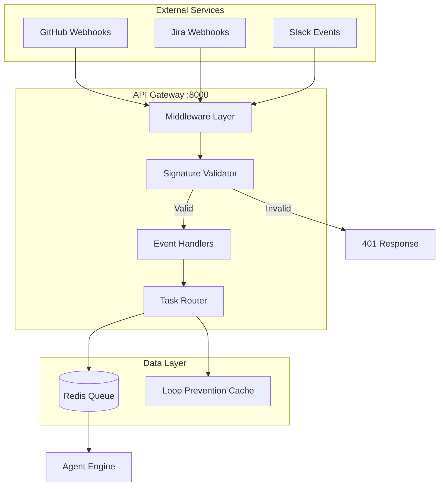
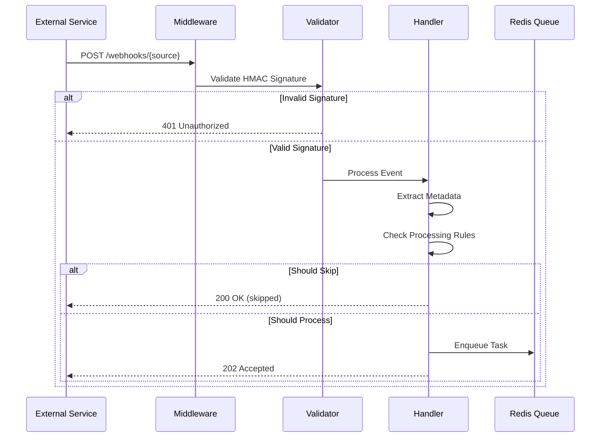
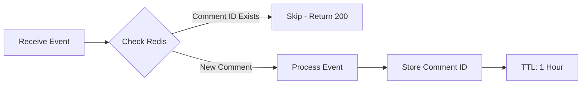

# API Gateway Architecture

## Overview

The API Gateway is the central webhook reception and routing service for the groote-ai system. It receives webhooks from GitHub, Jira, Slack, validates signatures, extracts routing metadata, and enqueues tasks to Redis for processing by agent-engine.

## Design Principles

1. **Fast Response** - Return HTTP response within 50ms, process asynchronously
2. **Security First** - HMAC signature validation via middleware
3. **Source Agnostic** - Unified task format regardless of webhook source
4. **Loop Prevention** - Redis-based tracking to prevent bot loops

## Component Architecture



## Directory Structure

```
api-gateway/
├── main.py                    # FastAPI app entry point
├── routes/
│   └── webhooks.py            # Webhook route registration
├── webhooks/
│   ├── github/                # GitHub webhook handler
│   │   ├── handler.py         # Event processing
│   │   ├── validator.py       # HMAC validation + middleware
│   │   ├── events.py          # Event type routing
│   │   └── models.py          # Pydantic models
│   ├── jira/                  # Jira webhook handler
│   │   ├── handler.py
│   │   ├── validator.py
│   │   └── events.py
│   └── slack/                 # Slack webhook handler
│       ├── handler.py
│       ├── validator.py
│       └── events.py
├── middleware/
│   └── error_handler.py       # WebhookValidationError class
├── config/
│   └── settings.py            # Configuration
└── tests/
    ├── fixtures/              # Webhook payload fixtures
    ├── conftest.py            # Shared fixtures
    └── test_*.py              # Test files
```

## Data Flow

### Webhook Processing Flow



## Event Filtering Rules

### GitHub Events

| Event Type | Actions Processed | Actions Skipped |
|------------|------------------|-----------------|
| issues | opened, edited, labeled | closed, deleted |
| issue_comment | created (with bot mention for PR comments) | edited, deleted |
| pull_request | review_requested | opened, closed, merged |
| pull_request_review_comment | created | edited, deleted |
| push | all | - |

### Jira Events

| Event Type | Condition | Action |
|------------|-----------|--------|
| jira:issue_created | Has `ai-agent` label OR agent mention | Process |
| jira:issue_updated | Has `ai-agent` label OR agent mention | Process |
| comment_created | Has `ai-agent` label OR agent mention (@agent, @groote, @bot, @ai-agent) | Process |
| * | No label and no mention | Skip |
| * | Bot comment detected | Skip |

### Slack Events

| Event Type | Condition | Action |
|------------|-----------|--------|
| app_mention | Not from bot | Process |
| message | Direct message, not bot | Process |
| * | From bot user | Skip |

## Task Structure

```json
{
    "task_id": "uuid",
    "source": "github | jira | slack",
    "event_type": "issue_comment | pull_request | ...",
    "prompt": "User's request text",
    "source_metadata": {
        "owner": "string",
        "repo": "string",
        "pr_number": 123,
        "comment_id": 456
    },
    "agent_type": "github-issue-handler | jira-code-plan | ...",
    "repo_path": "/app/repos/{owner}/{repo}",
    "status": "pending"
}
```

## Loop Prevention



## Testing Strategy

Tests focus on **behavior**, not implementation:

- ✅ "GitHub issue opened creates task with correct metadata"
- ✅ "Invalid signature returns 401"
- ✅ "Bot comments are skipped"
- ❌ "Redis LPUSH called with correct arguments"

## Integration Points

### With Agent Engine
```
API Gateway → LPUSH agent:tasks → Agent Engine (BRPOP)
```

### With GitHub API (Visual Response)
```
API Gateway → POST /reactions → GitHub API → GitHub
```
