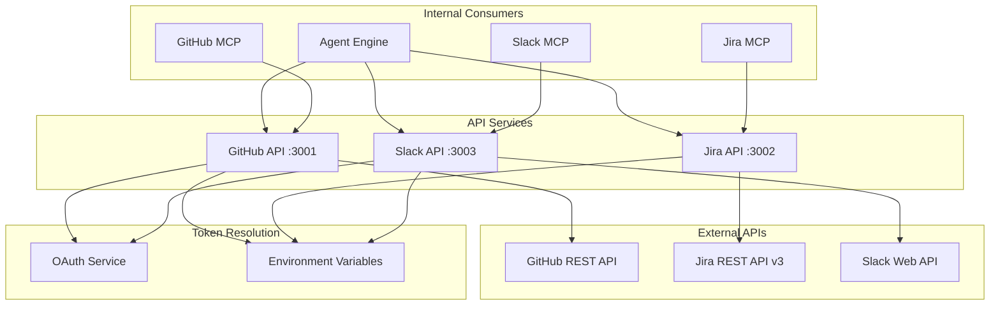
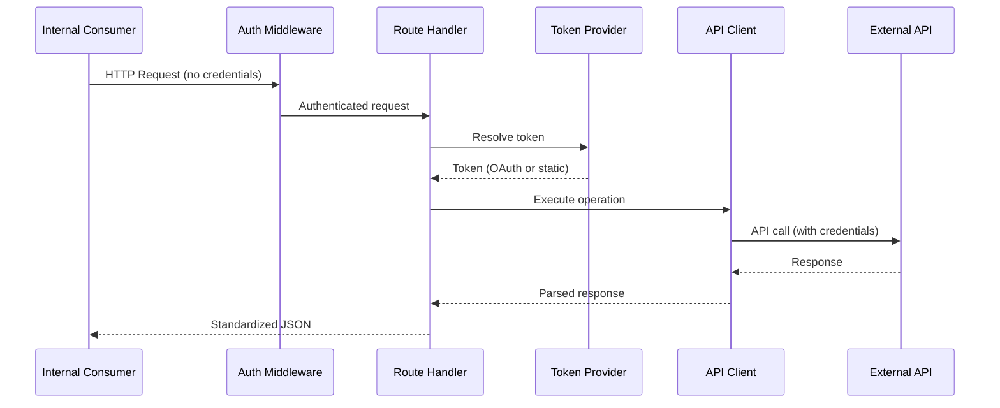

# API Services Architecture

## Overview

API Services is a collection of REST API wrappers for external services (GitHub, Jira, Slack). Each service isolates API credentials in its own container and provides a standardized interface for internal consumers.

## Design Principles

1. **Credential Isolation** - API keys stored only in their respective service containers
2. **Standardized Interface** - Uniform REST API patterns across all services
3. **Token Abstraction** - Internal services never handle external API tokens
4. **Multi-Tenant Ready** - OAuth token resolution per organization/workspace

## Component Architecture



## Directory Structure

```
api-services/
├── README.md
├── CLAUDE.md
├── docker-compose.services.yml
├── github-api/                # Port 3001
│   ├── main.py
│   ├── api/
│   │   ├── routes.py          # /api/v1/repos/* endpoints
│   │   └── server.py          # FastAPI app creation
│   ├── client/
│   │   ├── github_client.py   # GitHub API client
│   │   └── multi_tenant_client.py
│   ├── token_provider.py      # OAuth/PAT token resolution
│   ├── middleware/
│   │   └── auth.py
│   └── config/
│       └── settings.py
├── jira-api/                  # Port 3002
│   ├── main.py
│   ├── api/
│   │   ├── routes.py          # /api/v1/issues/*, /api/v1/search, etc.
│   │   └── server.py
│   ├── client/
│   │   ├── jira_client.py     # Jira API client
│   │   └── multi_tenant_client.py
│   ├── token_provider.py      # OAuth/Basic Auth resolution
│   ├── middleware/
│   │   └── auth.py
│   └── config/
│       └── settings.py
└── slack-api/                 # Port 3003
    ├── main.py
    ├── api/
    │   ├── routes.py          # /api/v1/messages, /api/v1/channels/*
    │   └── server.py
    ├── client/
    │   └── slack_client.py    # Slack API client
    ├── token_provider.py      # OAuth/Bot Token resolution
    ├── middleware/
    │   └── auth.py
    └── config/
        └── settings.py
```

## Shared Pattern

All three services follow the same architecture:



## Token Resolution

Each service supports two authentication modes:

| Mode | GitHub | Jira | Slack |
|------|--------|------|-------|
| Static | `GITHUB_TOKEN` (PAT) | `JIRA_EMAIL` + `JIRA_API_TOKEN` | `SLACK_BOT_TOKEN` |
| OAuth | Via oauth-service | Via oauth-service (Bearer) | Via oauth-service |

OAuth tokens are resolved per-organization/workspace via the OAuth Service when available, with fallback to static credentials.

## Route Prefix

All three services use the `/api/v1` route prefix for versioned API endpoints.

## Error Handling

Standardized error response format across all services:

```json
{
    "error": "not_found",
    "message": "Resource not found",
    "status_code": 404
}
```

## Testing Strategy

Tests focus on **behavior**, not implementation:

- Each service has co-located tests in its `tests/` directory
- Use respx/httpx mocking for external API calls
- No real network calls in tests
- Tests run in < 5 seconds per file

## Integration Points

### With MCP Servers
```
GitHub MCP → HTTP → GitHub API :3001 → GitHub REST API
Jira MCP   → HTTP → Jira API :3002   → Jira REST API
Slack MCP  → HTTP → Slack API :3003  → Slack Web API
```

### With Agent Engine
```
Agent Engine → HTTP → API Services → External APIs
```

### With OAuth Service
```
API Services → GET /oauth/token/{provider} → OAuth Service
```
