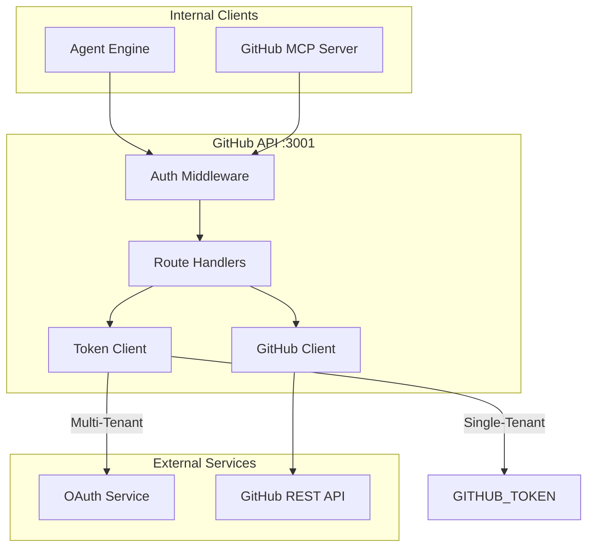
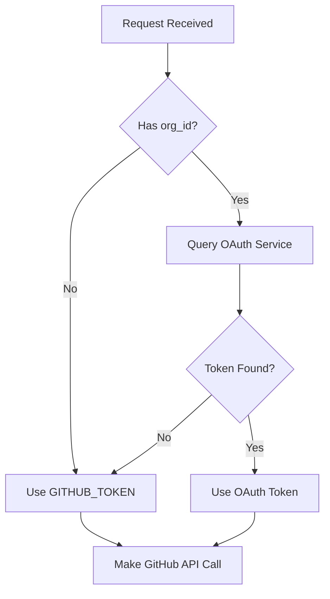
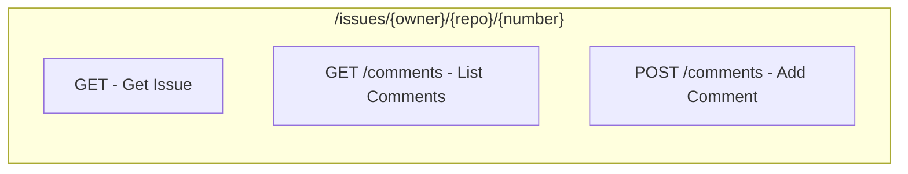
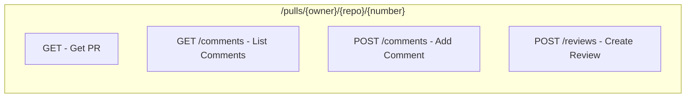
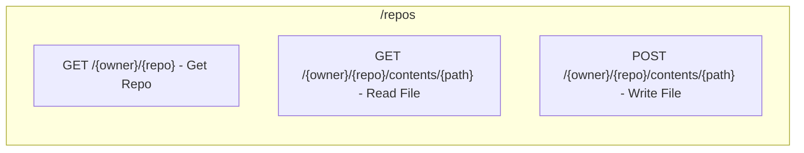
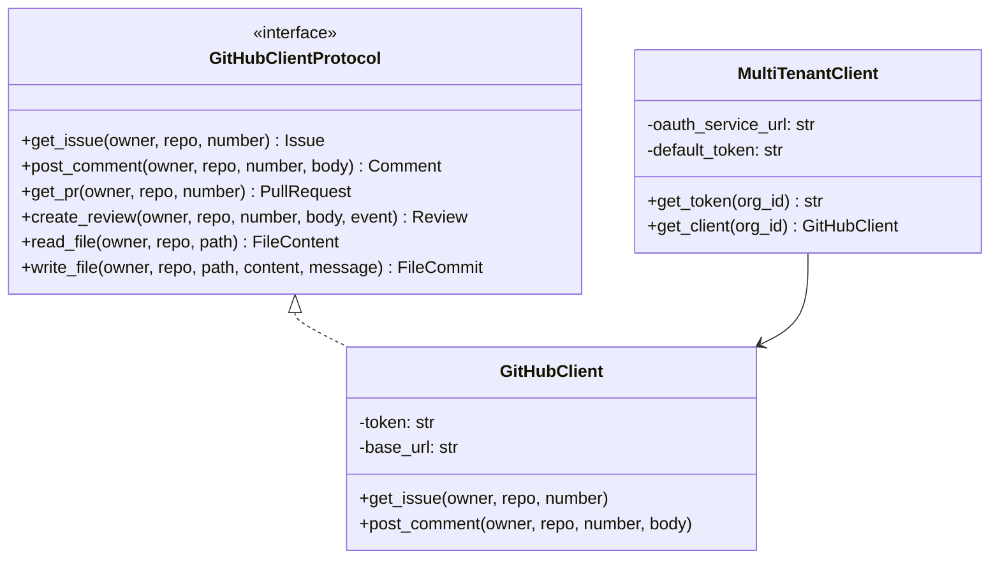
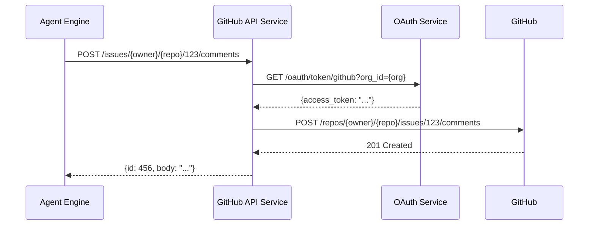
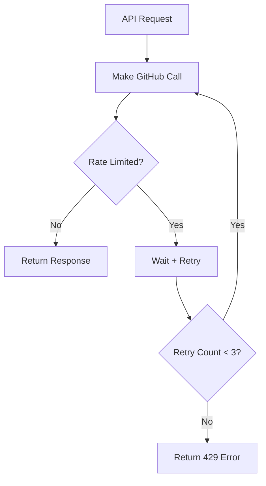

# GitHub API Service Architecture

## Overview

The GitHub API service provides REST endpoints for GitHub operations. It supports both single-tenant (Personal Access Token) and multi-tenant (OAuth per organization) authentication, acting as an abstraction layer between internal services and the GitHub API.

## Design Principles

1. **Token Abstraction** - Internal services don't handle GitHub tokens
2. **Multi-Tenant Ready** - OAuth tokens per organization
3. **Standardized Responses** - Unified error format across operations
4. **Rate Limit Aware** - Automatic retry with exponential backoff

## Component Architecture



## Directory Structure

```
github-api/
├── main.py                    # FastAPI application
├── api/
│   ├── routes.py              # API route definitions
│   └── server.py              # FastAPI app creation
├── client/
│   ├── github_client.py       # GitHub API client
│   └── multi_tenant_client.py # OAuth token management
├── middleware/
│   ├── auth.py                # Authentication middleware
│   └── error_handler.py       # Error handling
└── config/
    └── settings.py            # Configuration
```

## Token Resolution Flow



## API Endpoints

### Issues API



### Pull Requests API



### Repository API



## GitHub Client Protocol



## Data Flow

### Post Comment Flow



## Rate Limiting



| Limit Type | Value | Reset |
|------------|-------|-------|
| Core | 5,000/hour | Hourly |
| Search | 30/minute | Per minute |
| GraphQL | 5,000 points/hour | Hourly |

## Error Handling

### Error Response Format

```json
{
    "error": "not_found",
    "message": "Issue #999 not found",
    "status_code": 404,
    "details": {
        "owner": "acme",
        "repo": "project",
        "issue_number": 999
    }
}
```

### Error Mapping

| GitHub Status | Service Error | Message |
|--------------|---------------|---------|
| 404 | not_found | Resource not found |
| 401 | unauthorized | Invalid token |
| 403 | forbidden | Rate limited or no access |
| 422 | validation_error | Invalid request |

## Testing Strategy

Tests focus on **behavior**, not implementation:

- ✅ "Post comment returns comment ID"
- ✅ "Multi-tenant falls back to default token"
- ✅ "Rate limit triggers retry"
- ❌ "httpx.AsyncClient called with correct headers"

## Integration Points

### With OAuth Service
```
GitHub API → GET /oauth/token/github?org_id={org} → OAuth Service
```

### With Agent Engine
```
Agent Engine → POST /issues/{owner}/{repo}/{num}/comments → GitHub API → GitHub
```

### With MCP Server
```
GitHub MCP → GET /repos/{owner}/{repo}/contents/{path} → GitHub API → GitHub
```
