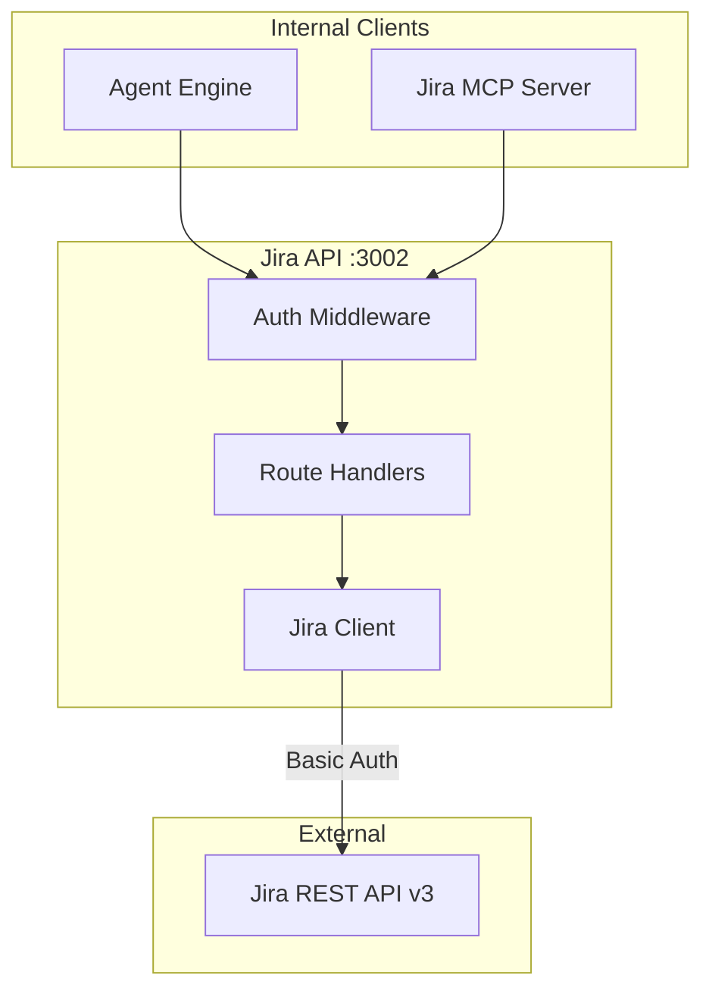
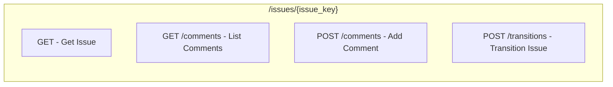
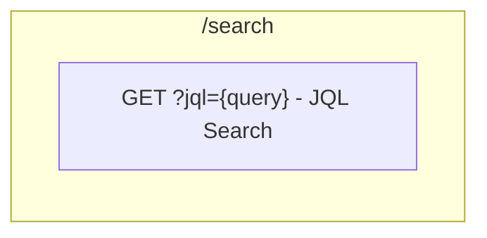
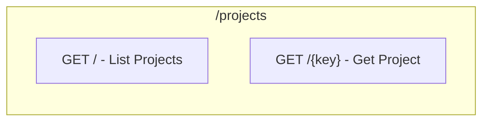
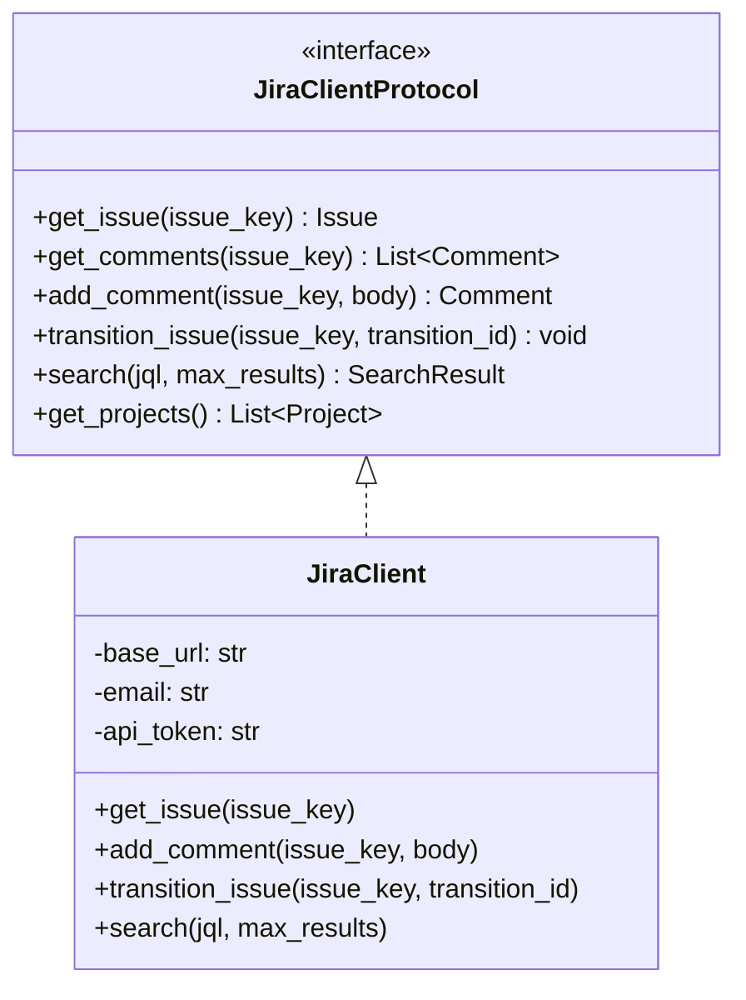
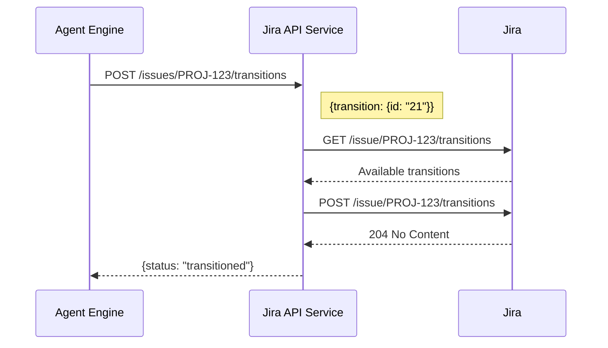
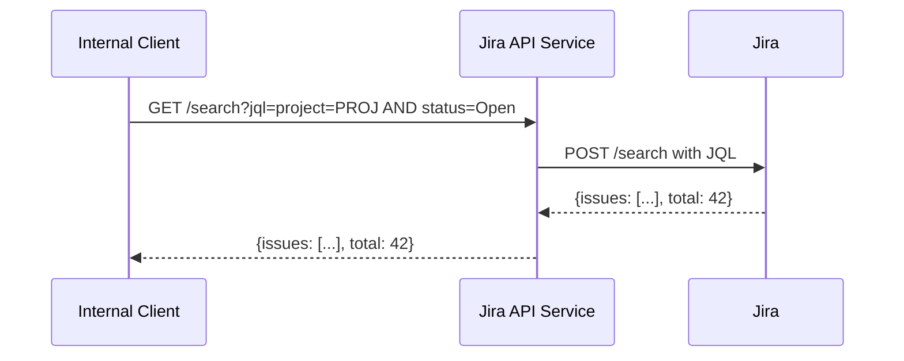
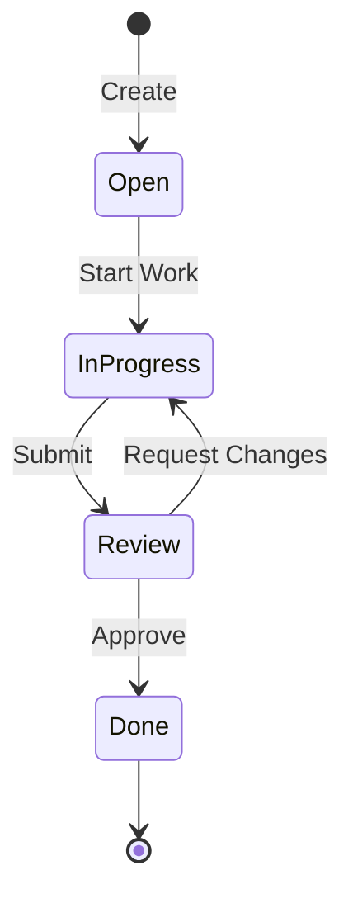

# Jira API Service Architecture

## Overview

The Jira API service provides REST endpoints for Jira operations, including issue management, comment posting, JQL search, and project operations. It abstracts the Jira REST API for internal services.

## Design Principles

1. **Authentication Abstraction** - Internal services don't handle Jira credentials
2. **JQL Support** - Full JQL query capabilities for complex searches
3. **Transition Management** - Handle workflow state changes
4. **Standardized Responses** - Unified error format

## Component Architecture



## Directory Structure

```
jira-api/
├── main.py                    # FastAPI application
├── api/
│   ├── routes.py              # API route definitions
│   └── server.py              # FastAPI app creation
├── client/
│   └── jira_client.py         # Jira API client
├── middleware/
│   ├── auth.py                # Authentication middleware
│   └── error_handler.py       # Error handling
└── config/
    └── settings.py            # Configuration
```

## Authentication Flow

```mermaid
flowchart TB
    A[Request Received] --> B[Load Credentials]
    B --> C[JIRA_EMAIL + JIRA_API_TOKEN]
    C --> D[Base64 Encode]
    D --> E[Authorization: Basic {encoded}]
    E --> F[Make Jira API Call]
```

## API Endpoints

### Issues API



### Search API



### Projects API



## Jira Client Protocol



## Data Flow

### Issue Transition Flow



### JQL Search Flow



## Issue Workflow



### Transition IDs (Example)

| Transition | ID | From | To |
|------------|-----|------|-----|
| Start Progress | 11 | Open | In Progress |
| Submit | 21 | In Progress | Review |
| Approve | 31 | Review | Done |
| Reject | 41 | Review | In Progress |

## Error Handling

### Error Response Format

```json
{
    "error": "not_found",
    "message": "Issue PROJ-999 not found",
    "status_code": 404,
    "details": {
        "issue_key": "PROJ-999"
    }
}
```

### Error Mapping

| Jira Status | Service Error | Message |
|-------------|---------------|---------|
| 404 | not_found | Issue not found |
| 401 | unauthorized | Invalid credentials |
| 403 | forbidden | No access |
| 400 | bad_request | Invalid JQL |

## Testing Strategy

Tests focus on **behavior**, not implementation:

- ✅ "Get issue returns issue details"
- ✅ "JQL search returns matching issues"
- ✅ "Invalid transition returns error"
- ❌ "httpx.AsyncClient called with Basic auth header"

## Integration Points

### With Agent Engine
```
Agent Engine → POST /issues/PROJ-123/comments → Jira API → Jira
```

### With MCP Server
```
Jira MCP → GET /search?jql=... → Jira API → Jira
```
