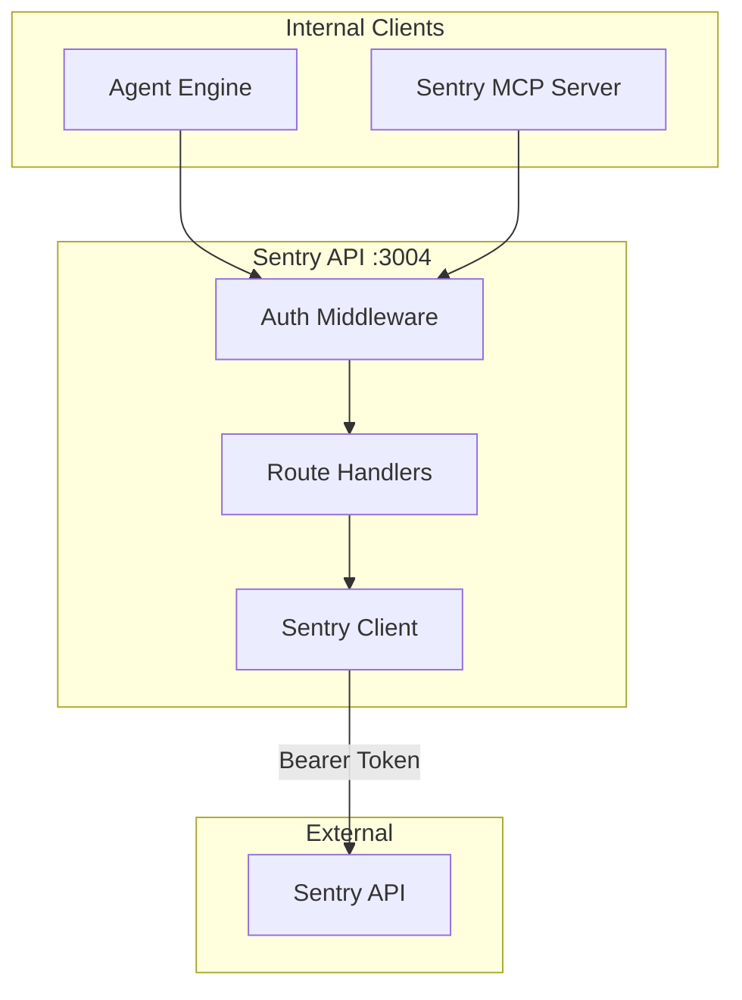
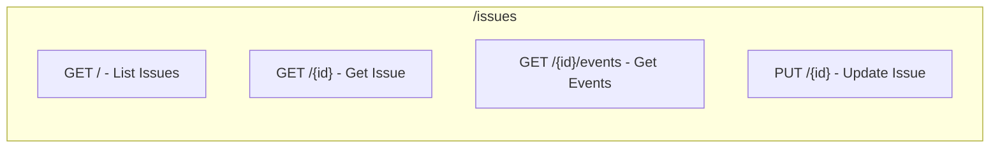
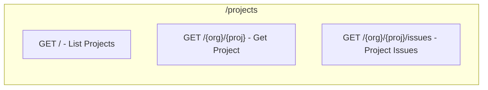
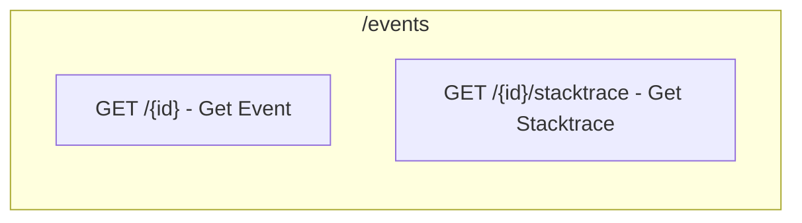
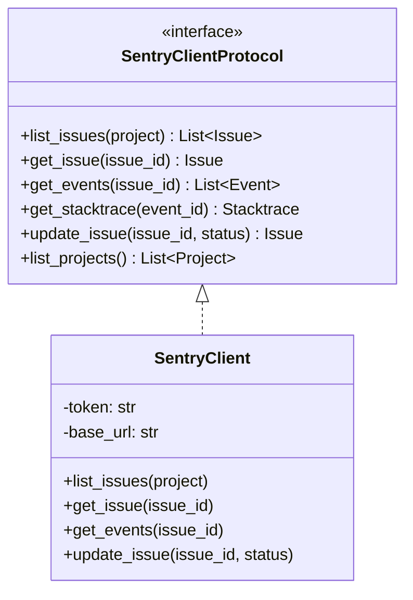
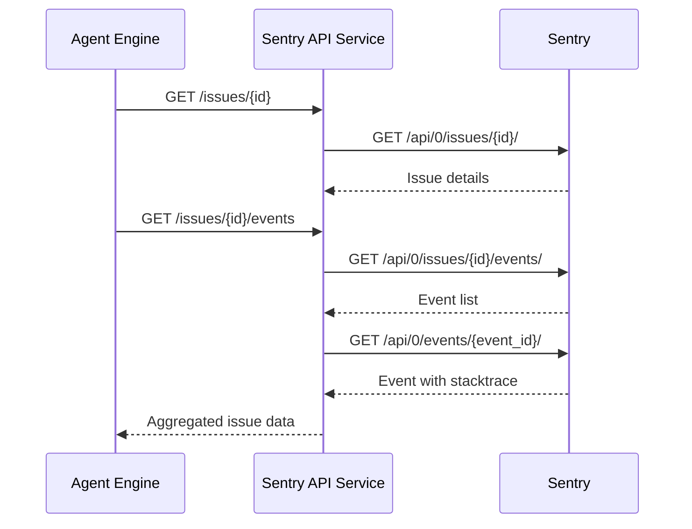
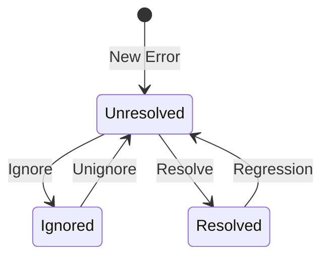
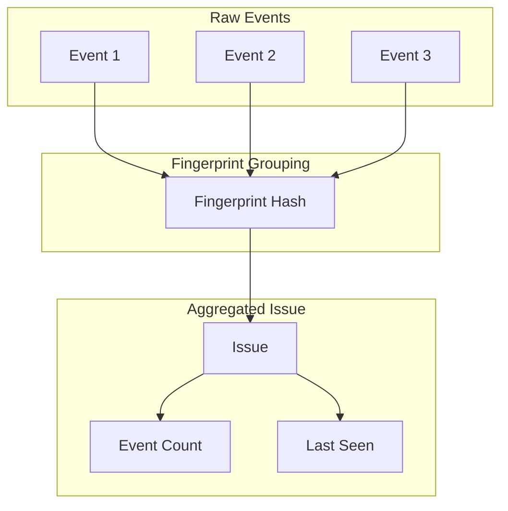

# Sentry API Service Architecture

## Overview

The Sentry API service provides REST endpoints for Sentry operations, including issue retrieval, event analysis, release management, and alert handling. It abstracts the Sentry API for internal services to enable error tracking integration.

## Design Principles

1. **Token Abstraction** - Internal services don't handle Sentry tokens
2. **Event Aggregation** - Group related errors and events
3. **Release Tracking** - Associate errors with deployments
4. **Alert Integration** - Process Sentry alerts for automation

## Component Architecture



## Directory Structure

```
sentry-api/
├── main.py                    # FastAPI application
├── api/
│   ├── routes.py              # API route definitions
│   └── server.py              # FastAPI app creation
├── client/
│   └── sentry_client.py       # Sentry API client
├── middleware/
│   ├── auth.py                # Authentication middleware
│   └── error_handler.py       # Error handling
└── config/
    └── settings.py            # Configuration
```

## Authentication Flow

```mermaid
flowchart TB
    A[Request Received] --> B[Load SENTRY_AUTH_TOKEN]
    B --> C[Authorization: Bearer {token}]
    C --> D[Make Sentry API Call]
```

## API Endpoints

### Issues API



### Projects API



### Events API



## Sentry Client Protocol



## Data Flow

### Issue Analysis Flow



## Issue Lifecycle



### Issue Status Values

| Status | Description |
|--------|-------------|
| unresolved | Active issue |
| resolved | Marked as fixed |
| ignored | Suppressed |
| resolvedInNextRelease | Auto-resolve on deploy |

## Event Aggregation



## Stacktrace Format

```json
{
    "issue_id": "12345",
    "event_id": "abc123",
    "stacktrace": {
        "frames": [
            {
                "filename": "src/main.py",
                "function": "process_request",
                "lineno": 42,
                "context_line": "    result = await handler(request)",
                "pre_context": ["    try:", "        validate(request)"],
                "post_context": ["    except Exception as e:", "        log_error(e)"]
            }
        ]
    }
}
```

## Error Handling

### Error Response Format

```json
{
    "error": "not_found",
    "message": "Issue 99999 not found",
    "status_code": 404,
    "details": {
        "issue_id": "99999"
    }
}
```

### Error Mapping

| Sentry Status | Service Error | Message |
|---------------|---------------|---------|
| 404 | not_found | Issue not found |
| 401 | unauthorized | Invalid token |
| 403 | forbidden | No access to project |
| 429 | rate_limited | Rate limited |

## Testing Strategy

Tests focus on **behavior**, not implementation:

- ✅ "Get issue returns issue with event count"
- ✅ "Get events returns stacktraces"
- ✅ "Update issue changes status"
- ❌ "httpx.AsyncClient called with correct headers"

## Integration Points

### With Agent Engine
```
Agent Engine → GET /issues/{id}/events → Sentry API → Sentry
```

### With MCP Server
```
Sentry MCP → GET /projects/{org}/{proj}/issues → Sentry API → Sentry
```

### With API Gateway (Alerts)
```
Sentry → POST /webhooks/sentry → API Gateway → Agent Engine
```
