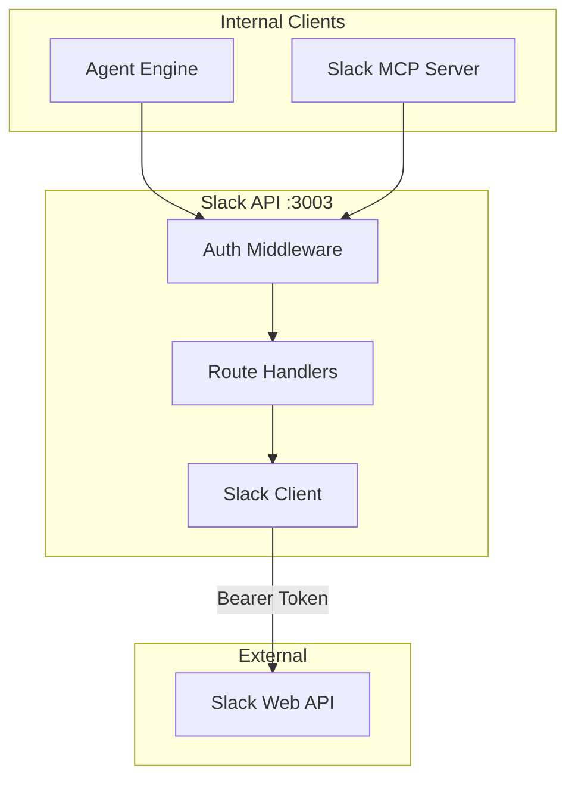
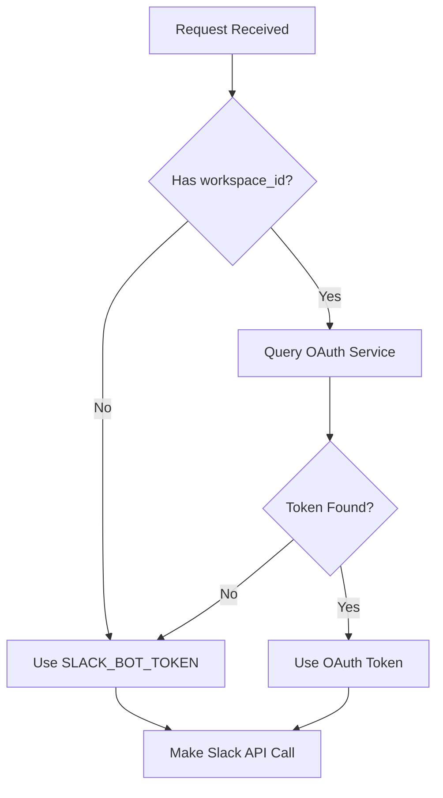
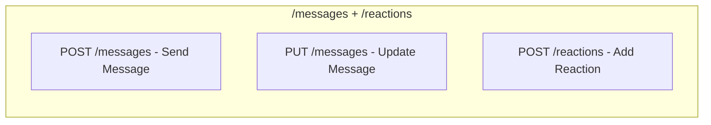
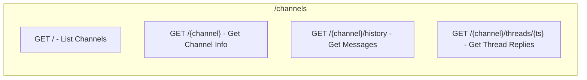
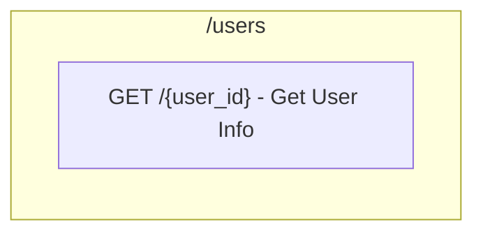
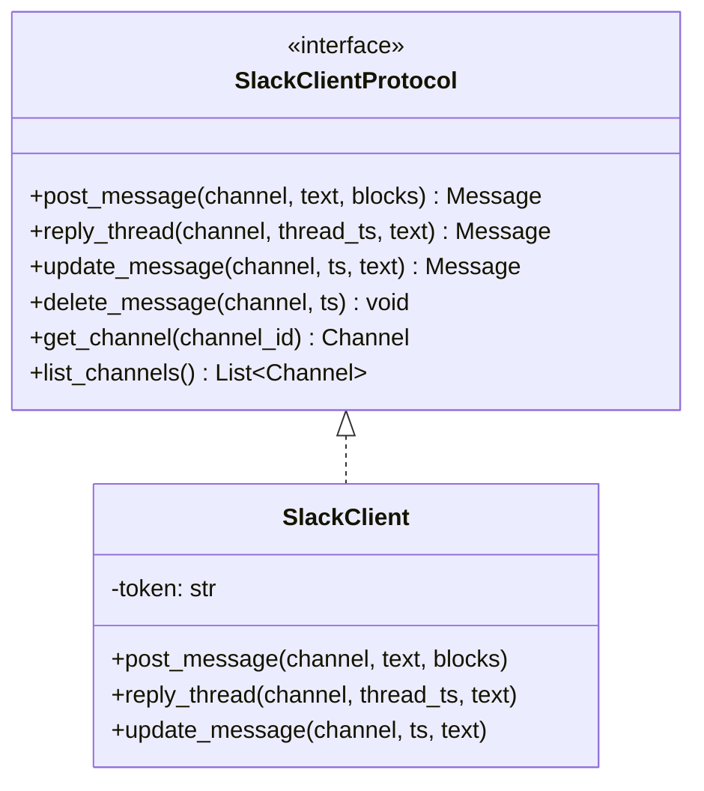
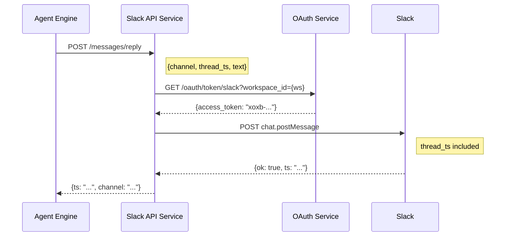
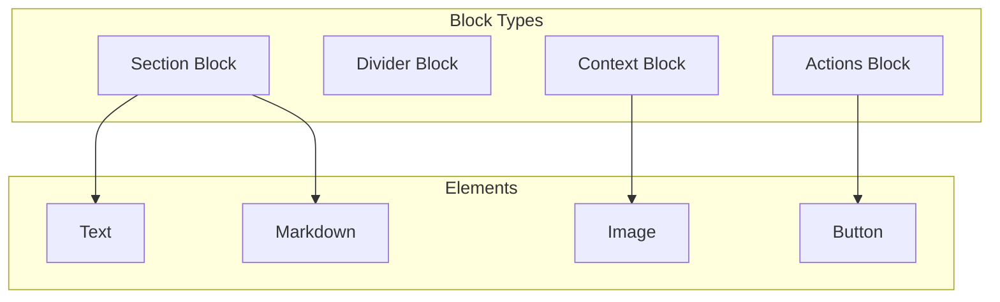
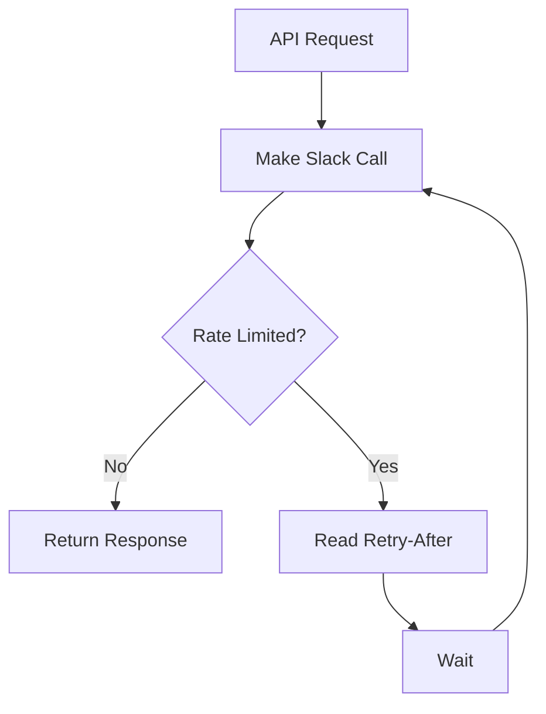

# Slack API Service Architecture

## Overview

The Slack API service provides REST endpoints for Slack operations, including message posting, thread replies, channel management, and user lookups. It abstracts the Slack Web API for internal services.

## Design Principles

1. **Token Abstraction** - Internal services don't handle Slack tokens
2. **Thread Awareness** - Support for threaded conversations
3. **Block Kit Support** - Rich message formatting
4. **Rate Limit Handling** - Automatic retry with backoff

## Component Architecture



## Directory Structure

```
slack-api/
├── main.py                    # FastAPI application
├── api/
│   ├── routes.py              # API route definitions
│   └── server.py              # FastAPI app creation
├── client/
│   └── slack_client.py        # Slack API client
├── middleware/
│   ├── auth.py                # Authentication middleware
│   └── error_handler.py       # Error handling
└── config/
    └── settings.py            # Configuration
```

## Authentication Flow



## API Endpoints

### Messages API (prefix: `/api/v1`)



### Channels API (prefix: `/api/v1`)



### Users API (prefix: `/api/v1`)



## Slack Client Protocol



## Data Flow

### Thread Reply Flow



## Message Formatting

### Block Kit Support



### Example Block Message

```json
{
    "channel": "C01234567",
    "blocks": [
        {
            "type": "section",
            "text": {
                "type": "mrkdwn",
                "text": "✅ *Task Completed*"
            }
        },
        {
            "type": "divider"
        },
        {
            "type": "section",
            "text": {
                "type": "mrkdwn",
                "text": "```\nCode changes applied\n```"
            }
        }
    ]
}
```

## Rate Limiting



| Tier | Methods | Rate |
|------|---------|------|
| Tier 1 | chat.postMessage | 1/sec |
| Tier 2 | conversations.list | 20/min |
| Tier 3 | users.list | 50/min |

## Error Handling

### Error Response Format

```json
{
    "error": "channel_not_found",
    "message": "Channel C99999999 not found",
    "status_code": 404,
    "details": {
        "channel_id": "C99999999"
    }
}
```

### Error Mapping

| Slack Error | Service Error | Message |
|-------------|---------------|---------|
| channel_not_found | not_found | Channel not found |
| invalid_auth | unauthorized | Invalid token |
| ratelimited | rate_limited | Rate limited |
| not_in_channel | forbidden | Bot not in channel |

## Testing Strategy

Tests focus on **behavior**, not implementation:

- ✅ "Post message returns message timestamp"
- ✅ "Thread reply includes parent ts"
- ✅ "Rate limit triggers retry"
- ❌ "Slack SDK called with correct arguments"

## Integration Points

### With OAuth Service
```
Slack API → GET /oauth/token/slack?workspace_id={ws} → OAuth Service
```

### With Agent Engine
```
Agent Engine → POST /messages/reply → Slack API → Slack
```

### With MCP Server
```
Slack MCP → GET /channels/{id}/history → Slack API → Slack
```
