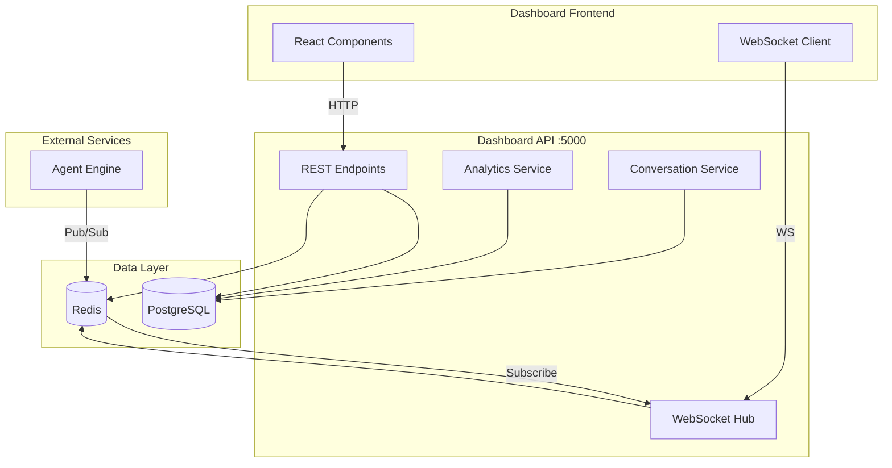
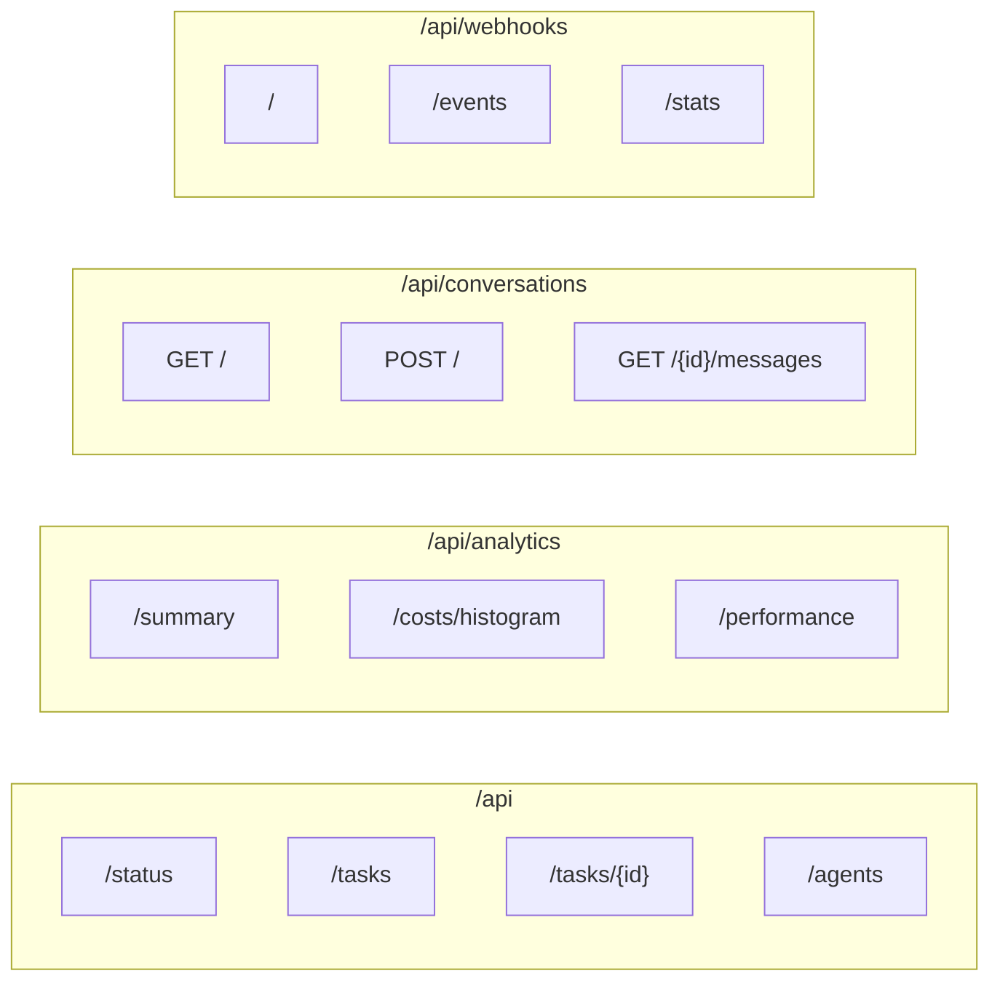
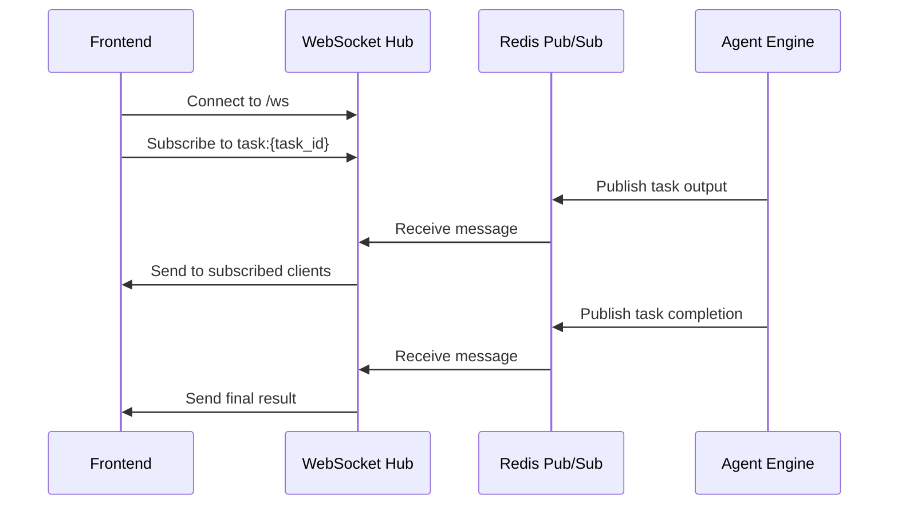
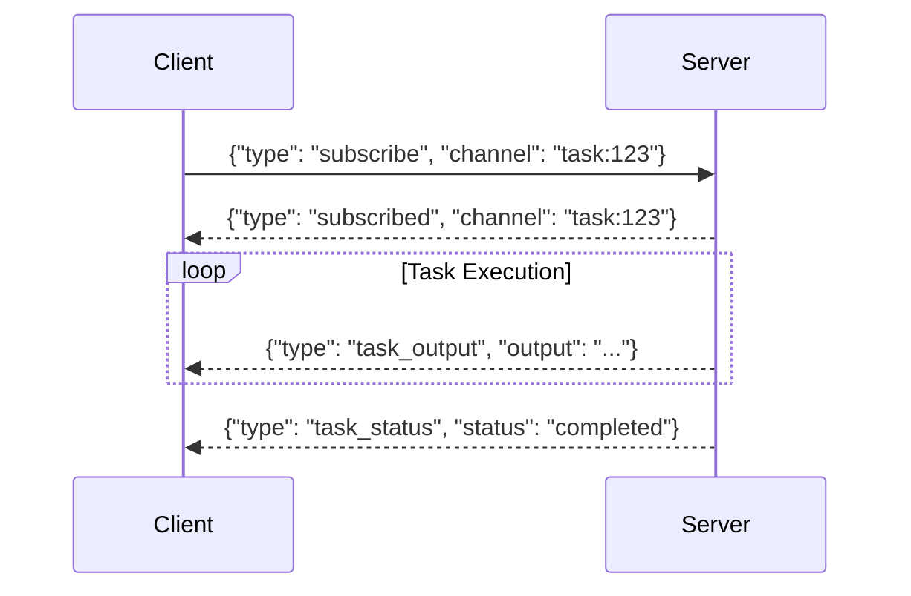
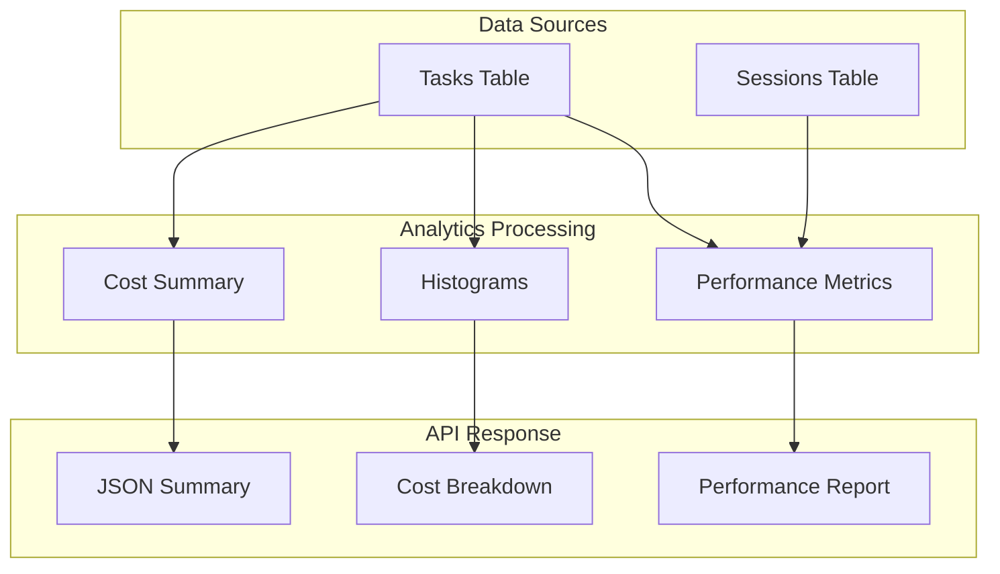
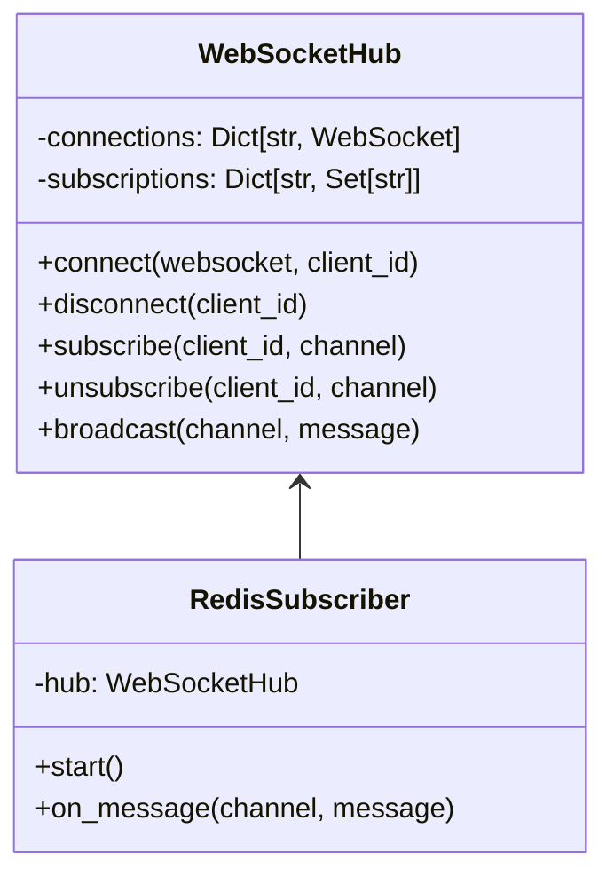
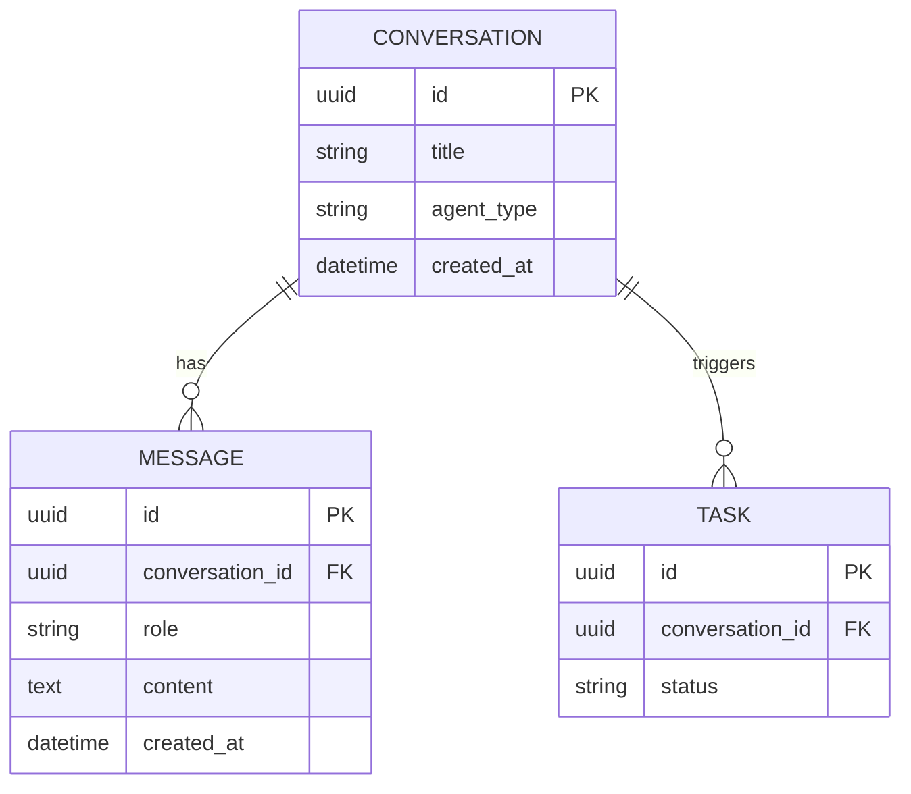

# Dashboard API Architecture

## Overview

The Dashboard API provides REST endpoints and WebSocket connections for the groote-ai dashboard. It handles task management, analytics, conversations, webhook status monitoring, and real-time updates.

## Design Principles

1. **Real-Time First** - WebSocket hub for live task streaming
2. **Analytics Ready** - Pre-computed metrics and histograms
3. **Multi-Source** - Unified view across PostgreSQL and Redis
4. **Conversation Context** - Chat interface for agent interactions

## Component Architecture



## Directory Structure

```
dashboard-api/
├── main.py                    # FastAPI application
├── api/
│   ├── dashboard.py           # Dashboard endpoints
│   ├── analytics.py           # Analytics endpoints
│   ├── conversations.py       # Conversation endpoints
│   ├── sources.py             # Data source management
│   ├── oauth_status.py        # OAuth status endpoints
│   ├── webhook_status.py      # Webhook monitoring
│   └── websocket.py           # WebSocket handler
├── core/
│   ├── config.py              # Configuration
│   ├── database/
│   │   ├── models.py          # SQLAlchemy models
│   │   ├── knowledge_models.py # Knowledge graph models
│   │   └── redis_client.py    # Redis client
│   ├── websocket_hub.py       # WebSocket connection manager
│   └── webhook_configs.py     # Webhook configuration loader
├── shared/
│   └── machine_models.py      # Shared Pydantic models
└── tests/
    ├── factories/             # Test data factories
    ├── conftest.py            # Shared fixtures
    └── test_*.py              # Test files
```

## API Structure

### REST Endpoints



## Data Flow

### Real-Time Task Streaming



### WebSocket Protocol



## Analytics Pipeline



### Metrics Computed

| Metric | Source | Aggregation |
|--------|--------|-------------|
| Total Cost | tasks.cost_usd | SUM |
| Avg Tokens | tasks.input_tokens + output_tokens | AVG |
| Success Rate | tasks.status | COUNT(completed) / COUNT(*) |
| Avg Duration | tasks.completed_at - created_at | AVG |
| Cost/Hour | tasks | GROUP BY hour |
| Tasks/Day | tasks | GROUP BY day |

## WebSocket Hub



## Conversation Model



## Testing Strategy

Tests focus on **behavior**, not implementation:

- ✅ "GET /api/tasks returns paginated results"
- ✅ "WebSocket receives task updates"
- ✅ "Analytics summary includes cost breakdown"
- ❌ "SQLAlchemy query uses correct joins"

## Integration Points

### With Agent Engine
```
Agent Engine → Redis Pub/Sub → Dashboard API WebSocket → Frontend
```

### With External Dashboard
```
React Frontend → HTTP/WS → Dashboard API → PostgreSQL/Redis
```
