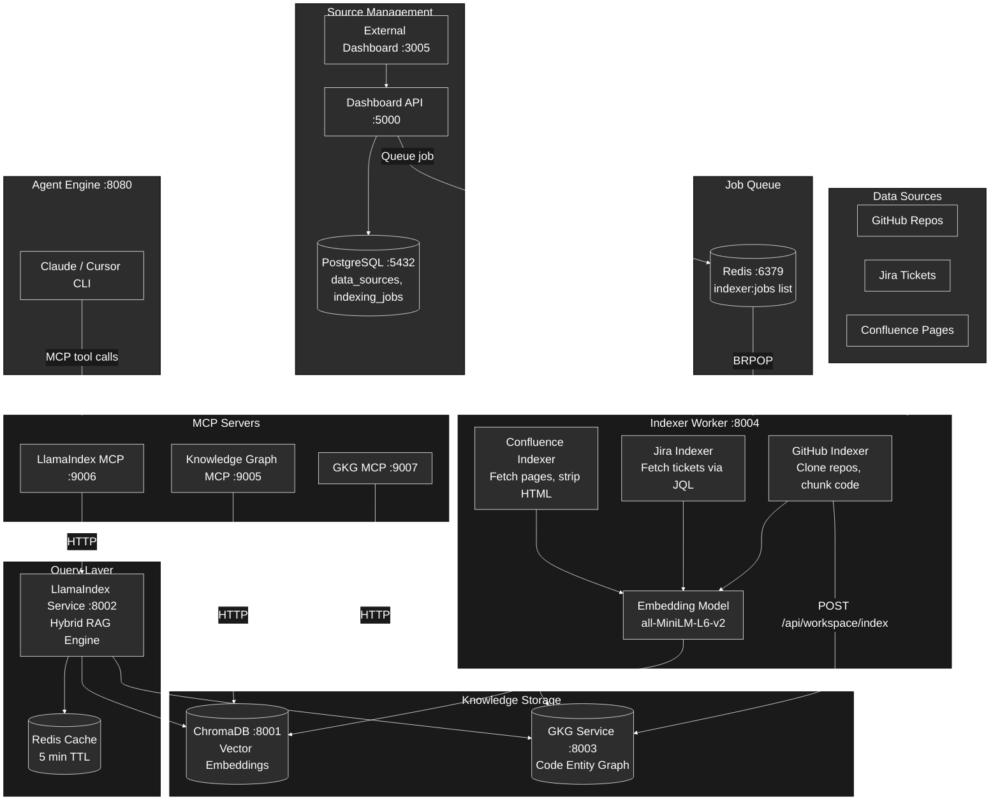
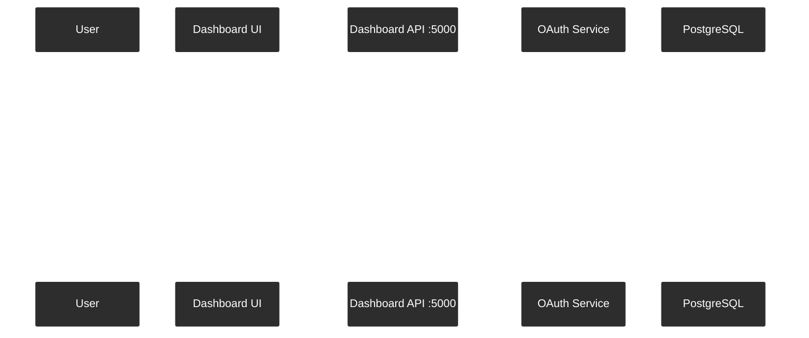
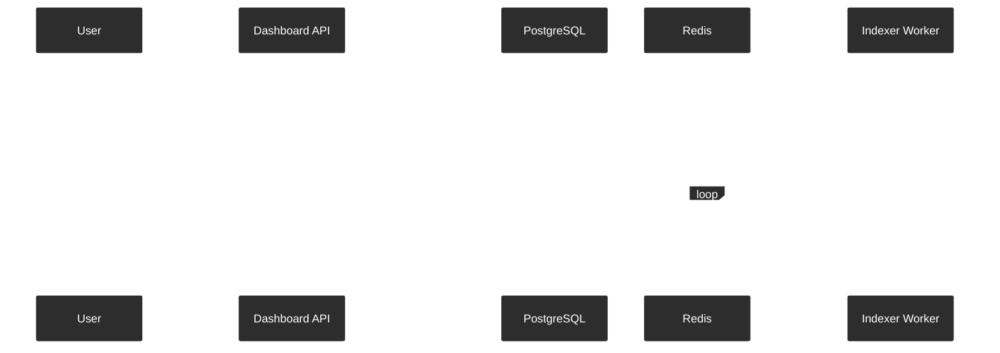
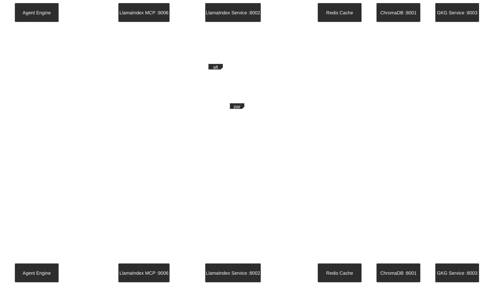
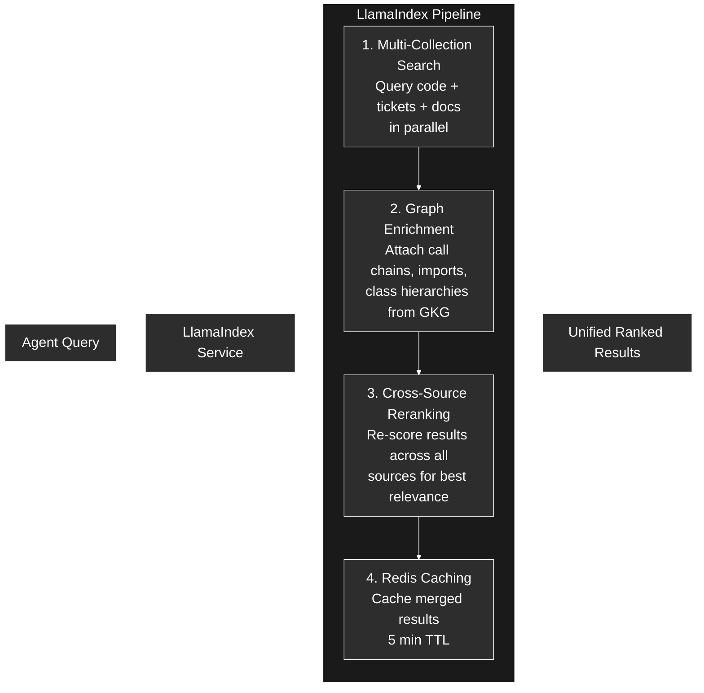

# Knowledge Layer Architecture

The knowledge layer is a **hybrid RAG system** that combines vector similarity search (ChromaDB) with graph-based code relationships (GKG) to give agents semantic understanding of your codebase, tickets, and documentation.

---

## System Overview



---

## Components

| Component | Port | Purpose |
|-----------|------|---------|
| Indexer Worker | 8004 | Background worker that fetches, chunks, and embeds content |
| ChromaDB | 8001 | Vector database storing embeddings for semantic search |
| GKG Service | 8003 | Code entity graph (functions, classes, imports, call chains) |
| LlamaIndex Service | 8002 | Hybrid RAG engine combining vector + graph results |
| Knowledge Graph MCP | 9005 | MCP interface for basic code search (core) |
| LlamaIndex MCP | 9006 | MCP interface for hybrid search (optional) |
| GKG MCP | 9007 | MCP interface for graph queries (optional) |

---

## End-to-End Flow

### Phase 1: Source Configuration

User adds a data source via the dashboard UI.



**Source configurations:**

| Source | Config Fields |
|--------|--------------|
| GitHub | `include_patterns`, `exclude_patterns`, `file_patterns`, `languages` |
| Jira | `jql`, `issue_types`, `include_labels`, `max_results` |
| Confluence | `spaces`, `include_labels`, `content_types` |

Data is stored in the `data_sources` table with a JSON config column.

---

### Phase 2: Indexing Trigger

User clicks "Sync" or the system triggers an incremental sync.



---

### Phase 3: Content Indexing

The indexer worker processes each source type differently.

#### GitHub Indexing

```
1. Fetch source config from Dashboard API
2. Clone or pull repos to /data/repos/{org_id}/{repo_name}
3. Walk file tree, apply file_patterns (e.g., **/*.py, **/*.ts)
4. Chunk files into CodeChunk objects (1000 chars, 200 char overlap)
5. Generate embeddings via sentence-transformers/all-MiniLM-L6-v2
6. Batch upsert to ChromaDB "code" collection (100 chunks/batch)
7. Send repo to GKG Service for graph extraction (functions, classes, imports)
```

**CodeChunk structure:**

```
id:         SHA hash of content
content:    "def authenticate(user)..."
repo:       "backend/auth-service"
file_path:  "src/auth/handler.py"
language:   "python"
line_start: 45
line_end:   67
```

#### Jira Indexing

```
1. Fetch tickets via Jira API using JQL or default filters
2. Paginate through results (100 per page, up to max_results)
3. Combine ticket key + summary + description + comments into markdown
4. Generate embeddings
5. Store in ChromaDB "jira_tickets" collection
```

**Metadata stored:** `key`, `summary`, `project`, `issue_type`, `status`, `priority`, `labels`, `created`, `updated`

#### Confluence Indexing

```
1. Fetch pages from specified spaces
2. Filter by labels (include/exclude)
3. Strip HTML (scripts, styles, tags) to clean text
4. Split large pages into chunks (1000 chars, 200 overlap)
5. Generate embeddings
6. Store in ChromaDB "confluence_docs" collection
```

**Metadata stored:** `page_id`, `page_title`, `space`, `labels`, `version`, `last_modified`, `chunk_index`

#### Status Tracking

Progress is tracked in multiple places during indexing:

| Location | Key/Table | Purpose |
|----------|-----------|---------|
| Redis hash | `indexer:status:{job_id}` | Real-time progress |
| Redis pub/sub | `indexer:completed:{org_id}` | Completion notification |
| PostgreSQL | `indexing_jobs` table | Persistent job status |

---

### Phase 4: Storage

#### ChromaDB Collections

| Collection | Content | Metadata |
|------------|---------|----------|
| `code` | Code chunks with embeddings | repo, file_path, language, line_start, line_end |
| `jira_tickets` | Jira issue content | key, project, status, priority, labels |
| `confluence_docs` | Documentation pages | page_id, space, labels, version |
| `github_issues` | GitHub issues (optional) | repo, number, state, labels |

All collections use `sentence-transformers/all-MiniLM-L6-v2` embeddings with cosine similarity.

#### GKG Graph Database

Binary graph format stored at `/data/gkg/{org_id}/*.db`:

- **Nodes:** Files, Functions, Classes, Modules
- **Edges:** CALLS, IMPORTS, EXTENDS, REFERENCES
- **Query:** Cypher-like syntax for traversal

---

### Phase 5: Query Runtime

When an agent needs knowledge, it calls MCP tools. The query flows through the hybrid RAG engine.



**Cache key:** `SHA256(query + org_id + source_types + top_k)` with 5 minute TTL.

---

## MCP Tools Available to Agents

### LlamaIndex MCP (port 9006) - Hybrid Search

| Tool | Purpose |
|------|---------|
| `knowledge_query` | Search across all sources (code, tickets, docs) |
| `code_search` | Code-specific semantic search |
| `search_jira_tickets` | Jira ticket semantic search |
| `search_confluence` | Documentation search |
| `find_related_code` | Graph-based code relationships |

### GKG MCP (port 9007) - Code Structure

| Tool | Purpose |
|------|---------|
| `analyze_dependencies` | File dependency tree |
| `find_usages` | Symbol usage locations |
| `get_call_graph` | Function call graph |
| `get_class_hierarchy` | Inheritance hierarchy |

### Knowledge Graph MCP (port 9005) - Core Search

| Tool | Purpose |
|------|---------|
| `search_code` | Search indexed code |
| `find_references` | Find code references |
| `get_call_graph` | Get function call graph |
| `get_dependencies` | Get code dependencies |

---

## LlamaIndex Service: The Query Orchestrator

LlamaIndex is **not** just a wrapper for ChromaDB. It's the orchestration brain that combines multiple data sources into a single unified response.

### What ChromaDB Does (Storage)

ChromaDB is a dumb vector database. It stores embeddings and returns the top-K nearest matches for a single collection. If you query ChromaDB directly, you get results from **one** collection at a time with no cross-source intelligence.

### What LlamaIndex Adds (Intelligence)

LlamaIndex sits between agents and storage, adding four layers of value:



#### 1. Multi-Collection Search

A single `knowledge_query` call searches across **all** ChromaDB collections simultaneously:

| Collection | What it searches |
|------------|-----------------|
| `code` | Code chunks from GitHub repos |
| `jira_tickets` | Jira issue content |
| `confluence_docs` | Confluence documentation |
| `github_issues` | GitHub issues (optional) |

Results from all collections are merged into one list and sorted by relevance score. Without LlamaIndex, the agent would need to make 3-4 separate ChromaDB queries and merge them manually.

#### 2. Graph Enrichment

For the top 5 code results, LlamaIndex calls GKG Service to fetch structural context:

```
Code result: "authenticate()" in auth/handler.py
  + GKG enrichment:
    - CALLS: validate_token(), check_permissions()
    - CALLED_BY: login_endpoint(), api_middleware()
    - IMPORTS: jwt_utils, user_model
```

This `graph_context` metadata is attached to the result, so the agent understands not just **what** the code does but **how it connects** to the rest of the codebase.

#### 3. Cross-Source Reranking

When enabled, a cross-encoder model re-scores all results (code + tickets + docs together) to find the most relevant matches across source types. This prevents a less-relevant code match from outranking a highly-relevant Jira ticket just because vector scores aren't comparable across collections.

#### 4. Redis Caching

Merged, enriched, reranked results are cached in Redis for 5 minutes. Cache key is `SHA256(query + org_id + source_types + top_k)`. During an agent workflow, the same knowledge query often runs multiple times — caching avoids redundant ChromaDB and GKG calls.

### API Endpoints

| Endpoint | What it does |
|----------|-------------|
| `POST /query` | Hybrid search across all sources (the main one) |
| `POST /query/code` | Code-only search with repo/language filters |
| `POST /query/tickets` | Jira-only search with project/status filters |
| `POST /query/docs` | Confluence-only search with space filter |
| `POST /graph/related` | Direct graph query via GKG (no vector search) |
| `GET /collections` | List available ChromaDB collections |
| `GET /health` | Service health with component status |

### Without LlamaIndex vs With LlamaIndex

| Capability | ChromaDB Only | With LlamaIndex |
|-----------|---------------|-----------------|
| Search one collection | Yes | Yes |
| Search across all sources at once | No | Yes |
| Merge and rank cross-source results | No | Yes |
| Graph enrichment (call chains, imports) | No | Yes |
| Cross-encoder reranking | No | Yes |
| Query caching | No | Yes |
| Filtered queries (repo, language, project) | Basic metadata filter | Typed query endpoints |

---

## Fallback Behavior

The agent engine includes a `KnowledgeService` that gracefully degrades when knowledge services are unavailable:

- Returns empty results if services are disabled or down
- 10 second timeout per request
- 2 retry attempts
- Health checks before queries

Agents can still function without the knowledge layer - they just lose semantic search capabilities.

---

## Related Documentation

- [Setup Guide](SETUP-KNOWLEDGE.md) - How to enable and configure knowledge services
- [Architecture Overview](ARCHITECTURE.md) - Full system architecture
- [Microservices Rules](../.claude/rules/microservices.md) - Service ports and communication
