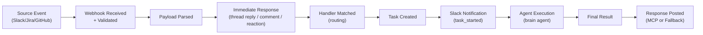

# E2E Task Log Analysis — Critical Review

**Date**: 2026-02-14 | **Tasks Analyzed**: 5 | **Total Cost**: $9.99 | **Total Duration**: ~14.5 min

---

## Task Inventory

| # | ID | Source | Trigger | Duration | Cost | Status | Handler |
|---|-----|--------|---------|----------|------|--------|---------|
| 1 | `fb047550` | Slack | message | 214s | $1.20 | ✅ completed | slack-inquiry |
| 2 | `28f24dc7` | Jira | comment_created | 128s | $0.83 | ⚠️ failed (metadata) / success (result) | jira-code-plan |
| 3 | `fe887f3f` | Jira | comment_created | 114s | $0.89 | ✅ completed | jira-code-plan |
| 4 | `203496bc` | Jira | issue_updated | 146s | $1.11 | ✅ completed | jira-code-plan |
| 5 | `48b76bae` | GitHub | issue_comment | 260s | $5.96 | ✅ completed | github-issue-handler |

---

## E2E Flow Diagram (Observed)



---

## Per-Task Deep Analysis

### Task 1: Slack → CI Fix (`fb047550`) — ✅ GOOD

- **Request**: Fix failing CI/CD on PR #13
- **Result**: Correctly identified ruff formatting issues across 46 files, ran formatter, pushed fix
- **Quality**: High — agent understood the task, diagnosed the issue, and resolved it autonomously
- **Cost efficiency**: $1.20 for a CI fix is reasonable
- **Response method**: MCP ✅

> [!TIP]
> This is the **best-performing task** in the batch — clean trigger, correct routing, good execution, proper MCP response.

---

### Task 2: Jira → Ticket Improvement (`28f24dc7`) — ⚠️ PROBLEMATIC

- **Request**: Improve Jira ticket GA-1 to expand documentation scope
- **Result**: Agent output shows it explored the codebase and intended to update the ticket
- **Issues found**:

> [!CAUTION]
> **Status Mismatch**: Metadata says `status: "failed"` but `06-final-result.json` says `success: true`. This is a **data integrity bug** — the system cannot be trusted to report accurate task status.

> [!WARNING]
> **Fallback Response**: `07-response-posting.jsonl` shows `"method": "fallback"`, `"mcp_detected": false`. The agent **did NOT** use MCP to respond to Jira. This means the response may not have been posted back to the Jira ticket reliably.

> [!WARNING]
> **Knowledge Search Quality**: The `code_search` for "README CLAUDE.md documentation files groote-ai" returned **irrelevant results** — it returned GitHub App setup constants and CLI test files, not actual documentation files. The knowledge index is either poorly built or the search algorithm has low precision.

---

### Task 3: Jira → Ticket Improvement Round 2 (`fe887f3f`) — ⚠️ MIXED

- **Request**: Further improve GA-1 ticket (add docs/ folders, scripts/audit)
- **Result**: Successfully updated ticket description with additional scope
- **Conversation continuity**: ✅ Correctly carried forward `conv-75a6873455fa`
- **Response method**: MCP ✅ (fixed from Task 2's fallback)
- **Issues found**:

> [!CAUTION]
> **Knowledge Search Returns Wrong Repo**: Searching "scripts audit README CLAUDE.md" returned results from `rom-orlovich/manga-creator` — a **completely unrelated repository**. The knowledge index is **cross-contaminated** between repos, leaking data from unrelated projects into search results.

> [!WARNING]
> **Knowledge Search Returns Irrelevant Code**: Even within the correct repo, search for "docs folder documentation files in services" returned `__init__.py` files and Chroma client code instead of actual documentation files.

---

### Task 4: Jira → Issue Updated / Plan Creation (`203496bc`) — ⚠️ SPURIOUS TRIGGER

- **Request**: Same ticket GA-1, but triggered by `jira:issue_updated` (label addition)
- **Result**: Created a draft PR #16 with an implementation plan

> [!CAUTION]
> **Spurious Trigger**: The changelog shows this was triggered by **adding the label "ai-agent"** to the ticket. This is NOT a user command — it's a metadata update. The system should NOT have created a new task for a label change.

> [!WARNING]
> **No Bot-Mention Check**: The `jira:issue_updated` event doesn't contain a comment with `@groote`, yet the handler still processed it. The routing logic does not filter issue_updated events to only those containing bot mentions.

- **Cost waste**: $1.11 spent on what should have been a no-op

---

### Task 5: GitHub → Plan Approval (`48b76bae`) — ⚠️ EXPENSIVE

- **Request**: `@groote approve this plan` on PR #16
- **Result**: "Plan approved. Starting implementation..." but the actual output is very thin for the cost
- **Issues found**:

> [!CAUTION]
> **Cost**: $5.96 for a plan approval that produced a 2-line result. This is **5x more expensive** than the actual CI fix task. The agent output file is 732KB — it appears the agent did extensive work (7,277 output tokens) but the visible result was minimal.

> [!WARNING]
> **Prompt Bloat**: The `enriched_prompt` contains the **entire plan body + full previous conversation** — approximately 5KB+ injected into the agent context. This drives up input token cost and may confuse the agent.

> [!WARNING]
> **All Tasks Go to Brain**: Every single task was assigned to `"assigned_agent": "brain"` regardless of complexity. The brain (Opus) is the most expensive model. A simple plan approval should not require Opus-level reasoning.

---

## Scoring

| Dimension | Score (1-10) | Justification |
|-----------|:---:|---------------|
| **Webhook Reception & Validation** | 9/10 | Fast, consistent, signatures verified every time |
| **Event Routing / Handler Matching** | 4/10 | Spurious triggers (label changes), no bot-mention filtering for `issue_updated` |
| **Agent Selection / Cost Efficiency** | 3/10 | Everything goes to `brain` (Opus). No tiered model selection. Plan approval costs $5.96 |
| **Knowledge Search Quality** | 2/10 | Cross-repo contamination, irrelevant results, wrong repos returned |
| **Status Tracking / Data Integrity** | 5/10 | Status mismatch (failed vs success), no error details logged |
| **Response Delivery** | 7/10 | MCP works 4/5 times, fallback exists but is unreliable |
| **Conversation Continuity** | 8/10 | Same `conversation_id` across GA-1 tasks, previous context carried forward |
| **Prompt Engineering** | 4/10 | Massive prompt bloat on multi-turn conversations, entire plan body injected |
| **Overall E2E Quality** | 5/10 | Core flow works but significant waste, data bugs, and search quality issues |

---

## Gap Analysis & Improvement Suggestions

### 🔴 Critical (Fix Immediately)

#### 1. Status Mismatch Bug
**Gap**: Task 2 has `metadata.status = "failed"` but `final-result.success = true`
**Fix**: The status determination logic in the task-logger or worker must derive status exclusively from `final-result.success`. Add a reconciliation step:
```python
# In task completion handler
if final_result.get("success") and metadata.get("status") == "failed":
    logger.error(f"Status mismatch for task {task_id}, reconciling to completed")
    metadata["status"] = "completed"
```
**File to investigate**: The worker's task completion handler or `task-logger`'s status update logic.

#### 2. Knowledge Index Cross-Contamination
**Gap**: Searching in `default-org` returns results from `rom-orlovich/manga-creator` — a completely different repository
**Fix**:
- **Immediate**: Add a `repo` filter to all `code_search` queries: `{"query": "...", "org_id": "default-org", "repo_filter": "rom-orlovich/groote-ai"}`
- **Structural**: Re-index only the target repo. Purge stale documents from the ChromaDB collection
- **Verify**: Run `mcp__llamaindex__code_search` with a test query and confirm 0 results from other repos

#### 3. Spurious Jira `issue_updated` Triggers
**Gap**: Label addition triggers a full task execution ($1.11 wasted)
**Fix**: In the Jira webhook handler, add filtering:
```python
# Only process issue_updated if:
# 1. Description changed (changelog contains "description" field), OR
# 2. A new comment contains a bot mention
changelog_fields = [item["field"] for item in payload["changelog"]["items"]]
if event_type == "jira:issue_updated":
    if "description" not in changelog_fields and "comment" not in changelog_fields:
        logger.info(f"Skipping issue_updated - only metadata change: {changelog_fields}")
        return  # Skip processing
```

---

### 🟡 Important (Fix Soon)

#### 4. Agent Selection — Stop Routing Everything to Brain/Opus
**Gap**: All 5 tasks assigned to `brain` agent (Opus), including a simple plan approval ($5.96)
**Fix**: Implement tiered routing:
| Task Type | Agent | Model | Est. Cost Reduction |
|-----------|-------|-------|---------------------|
| Plan approval (`approve` keyword) | executor | Sonnet | ~70% cheaper |
| Ticket improvement (`improve` keyword) | jira-code-plan | Sonnet | ~50% cheaper |
| CI fix (complex reasoning) | brain | Opus | Keep as-is |
| Code implementation | executor | Sonnet | ~50% cheaper |

#### 5. Prompt Bloat on Multi-Turn Conversations
**Gap**: Task 5's enriched_prompt includes the entire plan body (~2KB) + full conversation history (~4KB) = ~6KB of context
**Fix**:
- **Summarize** previous conversation turns instead of appending full text
- **Truncate** PR body to first 500 chars + link to full content
- **Estimated savings**: 50-70% reduction in input tokens for multi-turn tasks
```python
# Instead of injecting full PR body:
previous_summary = summarize_conversation(conversation_history, max_tokens=500)
enriched_prompt = f"""## Previous Context (summarized)
{previous_summary}

## Current Request
{current_message}
"""
```

#### 6. Fallback Response Method Reliability
**Gap**: Task 2 used `fallback` instead of MCP. When MCP fails, the system falls back but there's no retry or error logging about WHY MCP failed
**Fix**:
- Log the MCP failure reason in `07-response-posting.jsonl`
- Implement 1 retry before falling back
- Add an alert when fallback is triggered (it's a signal of an MCP connectivity issue)

---

### 🟢 Nice to Have (Improve Over Time)

#### 7. Knowledge Search Precision
**Gap**: Searching for "docs folder documentation files" returns `__init__.py` files
**Suggestions**:
- Implement file-type boosting in search (`.md` files should rank higher for documentation queries)
- Add metadata filters: `file_type: "markdown"` for doc-related queries
- Consider using separate collections for code vs. documentation

#### 8. Self-Triggering Protection
**Gap**: When the agent updates a Jira ticket (Task 2 → updated description), the `jira:issue_updated` webhook fires again (Task 4). This creates a potential loop.
**Fix**: Filter out events where the actor is the bot's own service account. Add a `bot_user_ids` denylist and check `payload.user.accountId` against it.

#### 9. Missing Log Phases
**Gap**: There's no `02-enrichment.jsonl` or `08-cleanup.jsonl` phase logged. The gap between `01-input.json` and `03-webhook-flow.jsonl` is invisible.
**Fix**: Add enrichment phase logging to track prompt construction time and any enrichment failures.

#### 10. Cost Controls & Budgeting
**Gap**: No per-task cost limits. Task 5 cost $5.96 — more than the rest combined.
**Fix**: Add a cost ceiling per task type (e.g., `max_cost_usd: 2.00` for non-implementation tasks). Alert if projected cost exceeds threshold.

---

## Cost Summary

| Category | Spent | Should Have Been | Savings |
|----------|-------|-----------------|---------|
| CI Fix (Task 1) | $1.20 | $1.20 | $0.00 |
| Ticket improvements (Tasks 2+3) | $1.72 | $0.60 (Sonnet) | **$1.12** |
| Spurious trigger (Task 4) | $1.11 | $0.00 (filtered) | **$1.11** |
| Plan approval (Task 5) | $5.96 | $1.50 (Sonnet) | **$4.46** |
| **Total** | **$9.99** | **$3.30** | **$6.69 (67% savings)** |

> [!IMPORTANT]
> With the suggested improvements, the same 5 tasks could have cost **~$3.30 instead of $9.99** — a **67% cost reduction**.

---

## Priority Action Items

1. **Fix status mismatch bug** — data integrity is non-negotiable
2. **Filter Jira `issue_updated` events** — stop processing label/metadata-only changes
3. **Purge knowledge index** — remove cross-repo contamination from manga-creator
4. **Add bot self-trigger protection** — prevent the agent from triggering itself via Jira updates
5. **Implement tiered agent routing** — use Sonnet for simple tasks, reserve Opus for complex reasoning
6. **Compress enriched prompts** — summarize conversation history, truncate PR bodies
