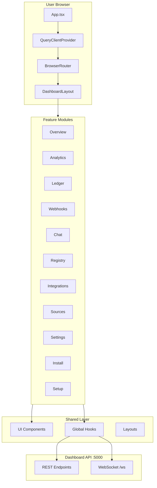
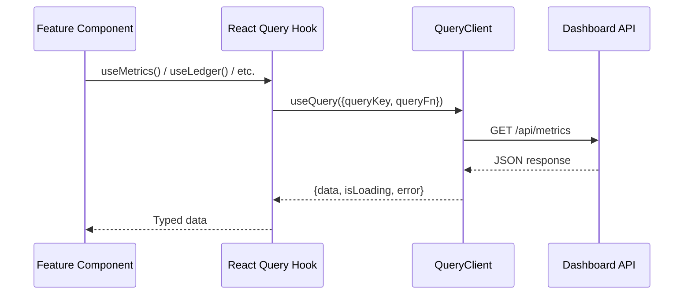
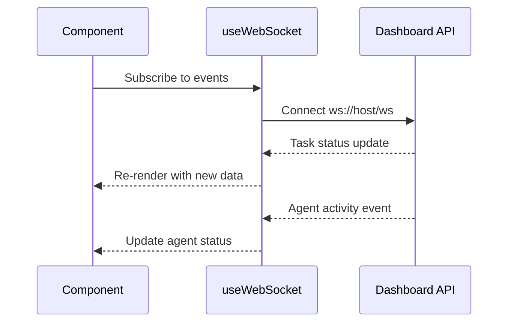

# External Dashboard Architecture

## Overview

The External Dashboard is a React 19 single-page application that provides the monitoring and management UI for groote-ai. It consumes the Dashboard API via REST and WebSocket, displaying real-time task updates, analytics, conversations, and system configuration.

## Design Principles

1. **Feature-Based Organization** - Each dashboard section is a self-contained feature module with its own components, hooks, and fixtures
2. **Server State via React Query** - TanStack Query manages all API data fetching, caching, and invalidation
3. **Real-Time Updates** - WebSocket connection provides live task status changes and agent activity
4. **Type Safety** - Strict TypeScript with no `any` types, Biome for linting

## Component Architecture



## Directory Structure

```
external-dashboard/
├── src/
│   ├── App.tsx                    # Root: QueryClient, Router, Routes
│   ├── main.tsx                   # Entry point
│   ├── index.css                  # Tailwind CSS imports
│   ├── components/
│   │   ├── ui/
│   │   │   ├── Header.tsx         # Top navigation bar
│   │   │   ├── Sidebar.tsx        # Side navigation
│   │   │   └── UsageLimits.tsx    # OAuth usage display
│   │   ├── TaskStatusModal.tsx    # Task detail modal
│   │   └── TaskModalTabs.tsx      # Tab navigation for task modal
│   ├── features/
│   │   ├── overview/              # Dashboard home (metrics, tasks)
│   │   ├── analytics/             # Cost and performance analytics
│   │   ├── ledger/                # Task log with filtering
│   │   ├── webhooks/              # Webhook management
│   │   ├── chat/                  # Conversation interface
│   │   ├── registry/              # Agent registry
│   │   ├── integrations/          # OAuth integration status
│   │   ├── sources/               # Source code management
│   │   ├── settings/              # AI provider and agent config
│   │   ├── install/               # Platform installation guide
│   │   └── setup/                 # Initial setup wizard
│   ├── hooks/
│   │   ├── useWebSocket.ts        # WebSocket connection management
│   │   ├── useCLIStatus.ts        # CLI agent status polling
│   │   ├── useTaskModal.ts        # Task modal state
│   │   ├── useTaskStream.ts       # Real-time task stream
│   │   ├── useConversations.ts    # Conversation data hooks
│   │   └── useOAuthUsage.ts       # OAuth rate limit tracking
│   ├── layouts/
│   │   └── DashboardLayout.tsx    # Shell: Header + Sidebar + Content
│   └── test/
│       └── setup.ts               # Vitest test setup
├── biome.json                     # Biome linter config
├── vite.config.ts                 # Vite + Tailwind + proxy config
├── tsconfig.json                  # TypeScript config
└── package.json                   # Dependencies
```

## Data Flow

### API Data Fetching



### Real-Time Updates



## Routing

| Path | Component | Description |
|------|-----------|-------------|
| `/` | OverviewFeature | Dashboard home with metrics |
| `/analytics` | AnalyticsFeature | Cost and performance charts |
| `/ledger` | LedgerFeature | Task log with filters |
| `/sources` | SourcesFeature | Source repository management |
| `/webhooks` | WebhooksFeature | Webhook configuration |
| `/chat` | ChatFeature | Conversation interface |
| `/registry` | RegistryFeature | Agent registry |
| `/integrations` | IntegrationsFeature | OAuth status |
| `/settings` | AIProviderSettings | AI provider configuration |
| `/install` | InstallPage | Platform installation |
| `*` | Navigate to `/` | Catch-all redirect |

## Proxy Configuration (Development)

Vite dev server proxies API calls to backend services:

| Path | Target | Description |
|------|--------|-------------|
| `/api/*` | `http://localhost:5001` | Dashboard API |
| `/oauth/*` | `http://localhost:8010` | OAuth Service |
| `/webhooks/*` | `http://localhost:8000` | API Gateway |
| `/ws` | `ws://localhost:5001` | WebSocket |

## Feature Module Pattern

Each feature follows a consistent structure:
```
features/{name}/
├── {Name}Feature.tsx          # Main feature component
├── hooks/
│   └── use{Name}.ts           # React Query hooks for data fetching
├── fixtures.ts                # Test data fixtures
├── {Name}.test.tsx            # Feature tests
└── {SubComponent}.tsx         # Feature-specific components
```

## Integration Points

### With Dashboard API
```
Dashboard -> REST /api/* -> Dashboard API :5000
Dashboard -> WebSocket /ws -> Dashboard API :5000
```

### With OAuth Service
```
Dashboard -> /oauth/* -> OAuth Service :8010
```

## Testing Strategy

Tests focus on **behavior**, not implementation:
- "Overview renders metric cards with data from API"
- "Ledger filters tasks by status"
- "Chat sends messages and displays responses"

Test stack: Vitest + happy-dom + React Testing Library
