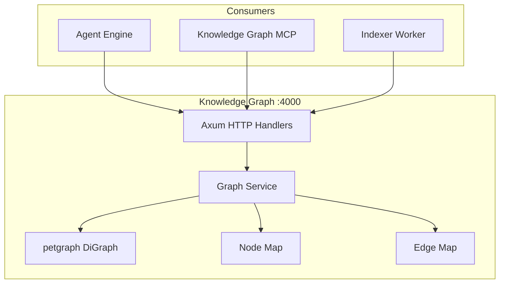
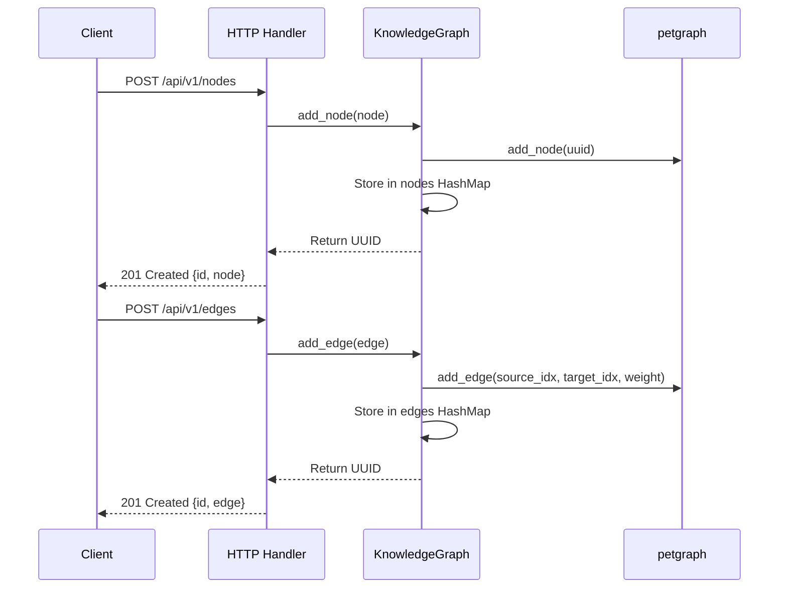
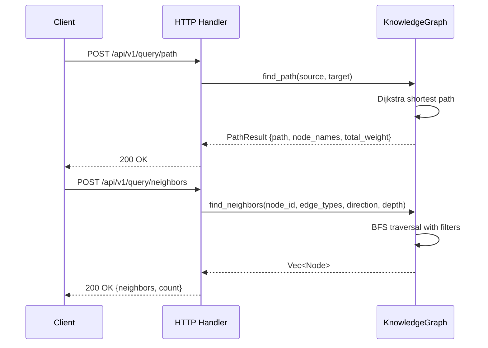

# Knowledge Graph Architecture

## Overview

The Knowledge Graph is a Rust-based in-memory graph database for storing and querying code entity relationships. It provides path finding, neighbor traversal, and semantic search across code entities like functions, classes, modules, and files.

## Design Principles

1. **In-Memory Performance** - All graph operations run against an in-memory petgraph structure for microsecond-level query response
2. **Typed Relationships** - 11 distinct node types and 11 edge types enforce semantic correctness of code relationships
3. **Concurrent Safety** - Arc<RwLock> pattern allows multiple concurrent reads with exclusive writes
4. **Weighted Traversal** - Edge weights enable Dijkstra-based shortest path computation

## Component Architecture



## Directory Structure

```
knowledge-graph/
├── src/
│   ├── main.rs              # Axum app entry point, route registration
│   ├── api/
│   │   ├── mod.rs            # API module exports
│   │   └── handlers.rs       # HTTP request handlers (12 endpoints)
│   ├── models/
│   │   ├── mod.rs            # Model re-exports
│   │   ├── node.rs           # Node, NodeType, CreateNodeRequest
│   │   ├── edge.rs           # Edge, EdgeType, CreateEdgeRequest
│   │   └── query.rs          # PathQuery, NeighborsQuery, SearchQuery, GraphStats
│   └── services/
│       ├── mod.rs            # Service module exports
│       └── graph.rs          # KnowledgeGraph core logic + unit tests
├── config/
│   └── repos.json            # Repository configuration
├── Cargo.toml                # Dependencies
└── Dockerfile                # Multi-stage Rust build
```

## Data Flow

### Node and Edge Management



### Query Operations



## Data Models

### Node Types

| Type | Description |
|------|-------------|
| Repository | Top-level code repository |
| File | Source file |
| Function | Function or method |
| Class | Class definition |
| Module | Module or package |
| Variable | Variable declaration |
| Constant | Constant value |
| Import | Import statement |
| Agent | AI agent entity |
| Skill | Agent capability |
| Task | Processing task |

### Edge Types

| Type | Description |
|------|-------------|
| Contains | Parent contains child |
| Imports | File imports module |
| Calls | Function calls function |
| Inherits | Class inherits from class |
| Implements | Class implements interface |
| Uses | Entity uses entity |
| DependsOn | Module depends on module |
| DefinedIn | Entity defined in file |
| References | Entity references entity |
| Handles | Handler processes event |
| Delegates | Entity delegates to entity |

## State Management

The service uses a shared `AppState` with `Arc<RwLock<KnowledgeGraph>>`:
- **Read operations** (list, get, query, search, stats) acquire a read lock
- **Write operations** (create, delete) acquire a write lock
- Multiple readers can execute concurrently; writes are exclusive

## Integration Points

### With Knowledge Graph MCP
```
MCP Server -> HTTP -> Knowledge Graph :4000 -> Graph Operations
```

### With Indexer Worker
```
Indexer Worker -> POST /api/v1/nodes + POST /api/v1/edges -> Knowledge Graph
```

### With Agent Engine
```
Agent Engine -> POST /api/v1/query/* -> Knowledge Graph -> Query Results
```

## Testing Strategy

Tests focus on **behavior**, not implementation:
- "Adding a node returns its UUID and is retrievable"
- "Adding an edge between existing nodes succeeds"
- "Finding neighbors returns correct depth-1 outgoing nodes"
- "Search filters by name substring and language"
