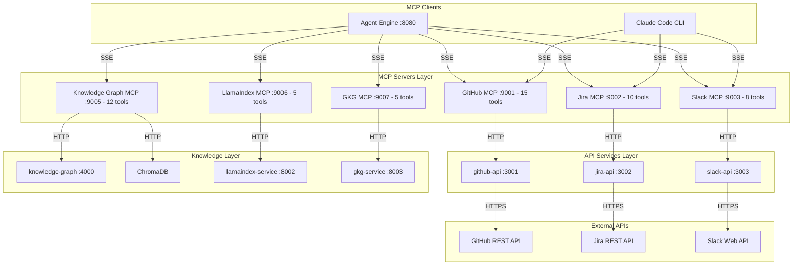

# MCP Servers Architecture

## Overview

The MCP Servers layer provides 6 protocol translation servers that expose 55 tools total for AI agents. Each server translates Model Context Protocol (MCP) calls into HTTP requests to backend API services, maintaining strict credential isolation.

## Design Principles

1. **Credential Isolation** - MCP servers never store API keys; credentials live in API services
2. **Thin Wrappers** - No business logic, pure protocol translation
3. **SSE Transport** - All servers use Server-Sent Events for MCP communication
4. **Formatted Output** - Results formatted for LLM consumption (markdown)
5. **Independent Deployment** - Each server runs as its own container

## System Architecture



## Server Categories

### External Service Wrappers (Ports 9001-9003)

Wrap API services that proxy to external SaaS APIs (GitHub, Jira, Slack). Two-hop architecture: MCP -> API Service -> External API.

| Server | Port | Backend | Tools |
|--------|------|---------|-------|
| GitHub MCP | 9001 | github-api:3001 | 15 |
| Jira MCP | 9002 | jira-api:3002 | 10 |
| Slack MCP | 9003 | slack-api:3003 | 8 |

### Knowledge Service Wrappers (Ports 9005-9007)

Wrap internal knowledge services. Single-hop architecture: MCP -> Knowledge Service.

| Server | Port | Backend | Tools |
|--------|------|---------|-------|
| Knowledge Graph MCP | 9005 | knowledge-graph:4000 + ChromaDB | 12 |
| LlamaIndex MCP | 9006 | llamaindex-service:8002 | 5 |
| GKG MCP | 9007 | gkg-service:8003 | 5 |

## Shared Patterns

### Client Architecture

All external service MCP servers (GitHub, Jira, Slack) use the same HTTP client pattern:

- Lazy-initialized `httpx.AsyncClient` with configurable base_url and timeout
- Client reused across requests within the same server lifecycle
- `close()` method for graceful shutdown

### Knowledge MCP Patterns

LlamaIndex and GKG MCPs create inline `httpx.AsyncClient` per request. Knowledge Graph MCP uses both a shared KG client and a shared ChromaDB client.

### Configuration

All servers use `pydantic-settings` for configuration with environment variable support and `.env` file fallback.

## Security Architecture

```
+---------------------------+     +---------------------------+
|      MCP Server           |     |      API Service          |
|                           |     |                           |
|  NO credentials           |     |  HAS credentials          |
|  NO direct API access     |     |  Direct API access        |
|  HTTP proxy only          |     |  Token management         |
+---------------------------+     +---------------------------+
         |                                 |
         | HTTP (internal network)         | HTTPS (external)
         +-------> API Service -----------> External API
```

## Testing Strategy

All MCP servers use the same testing approach:

- `respx` for mocking HTTP calls to backend services
- `pytest-asyncio` for async test support
- `fastmcp` for tool function testing (`.fn()` method)
- No real network calls in tests
- Tests must run in < 5 seconds per file
