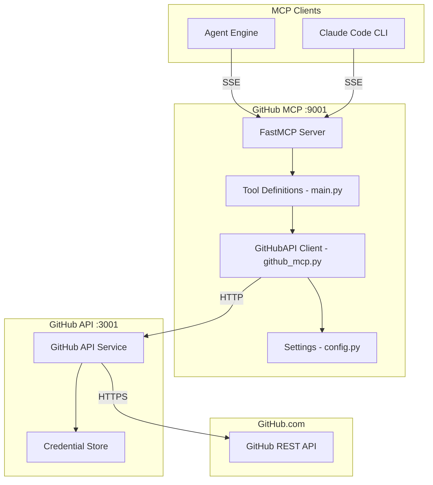
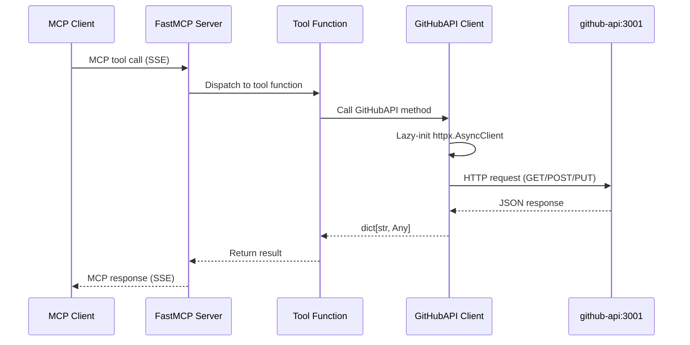

# GitHub MCP Architecture

## Overview

The GitHub MCP server is a thin protocol translation layer that exposes 15 GitHub operations as MCP tools. It delegates all API calls to the GitHub API service (port 3001), maintaining credential isolation.

## Design Principles

1. **Thin Wrapper** - No business logic, pure protocol translation
2. **Credential Isolation** - Never stores API keys, delegates to github-api
3. **Lazy Connection** - HTTP client created on first use, reused across requests
4. **Passthrough Design** - Parameters forwarded directly to backend

## Component Architecture



## Directory Structure

```
github-mcp/
├── main.py              # FastMCP server + 15 tool registrations
├── github_mcp.py        # GitHubAPI class (HTTP client wrapper)
├── config.py            # Settings via pydantic-settings
├── requirements.txt     # Runtime: fastmcp, httpx, pydantic-settings
├── requirements-dev.txt # Test: pytest, respx, pytest-asyncio
├── Dockerfile           # Python 3.11-slim + uv
└── tests/
    ├── conftest.py      # sys.path setup + fixtures
    └── test_github_mcp.py  # respx-based behavior tests
```

## Data Flow

### Tool Invocation Flow



## Client Architecture

The `GitHubAPI` class in `github_mcp.py` uses a lazy-initialized `httpx.AsyncClient`:

- **Base URL**: Configured from `GITHUB_API_URL` (default: `http://github-api:3001`)
- **Timeout**: Configurable via `REQUEST_TIMEOUT` (default: 30s)
- **Lifecycle**: Client created on first request, reused until `close()` called

## API Endpoint Mapping

| Tool | HTTP Method | Backend Endpoint |
|------|-------------|-----------------|
| `get_repository` | GET | `/api/v1/repos/{owner}/{repo}` |
| `get_issue` | GET | `/api/v1/repos/{owner}/{repo}/issues/{number}` |
| `create_issue` | POST | `/api/v1/repos/{owner}/{repo}/issues` |
| `add_issue_comment` | POST | `/api/v1/repos/{owner}/{repo}/issues/{number}/comments` |
| `add_reaction` | POST | `/api/v1/repos/{owner}/{repo}/issues/comments/{id}/reactions` |
| `get_pull_request` | GET | `/api/v1/repos/{owner}/{repo}/pulls/{number}` |
| `create_pull_request` | POST | `/api/v1/repos/{owner}/{repo}/pulls` |
| `create_pr_review_comment` | POST | `/api/v1/repos/{owner}/{repo}/pulls/{number}/comments` |
| `get_file_contents` | GET | `/api/v1/repos/{owner}/{repo}/contents/{path}` |
| `search_code` | GET | `/api/v1/search/code` |
| `list_branches` | GET | `/api/v1/repos/{owner}/{repo}/branches` |
| `list_repos` | GET | `/api/v1/installation/repos` |
| `get_branch_sha` | GET | `/api/v1/repos/{owner}/{repo}/git/ref/heads/{branch}` |
| `create_branch` | POST | `/api/v1/repos/{owner}/{repo}/git/refs` |
| `create_or_update_file` | PUT | `/api/v1/repos/{owner}/{repo}/contents/{path}` |

## Testing Strategy

Tests focus on **behavior**, not implementation:

- "get_repository returns repository data from backend"
- "create_issue sends correct payload to backend"
- "add_reaction forwards reaction content to backend"
- Uses `respx` to mock HTTP calls to github-api service

## Integration Points

### With Agent Engine
```
Agent Engine --> SSE /sse --> GitHub MCP :9001
```

### With GitHub API Service
```
GitHub MCP --> HTTP --> github-api:3001 --> GitHub REST API
```
