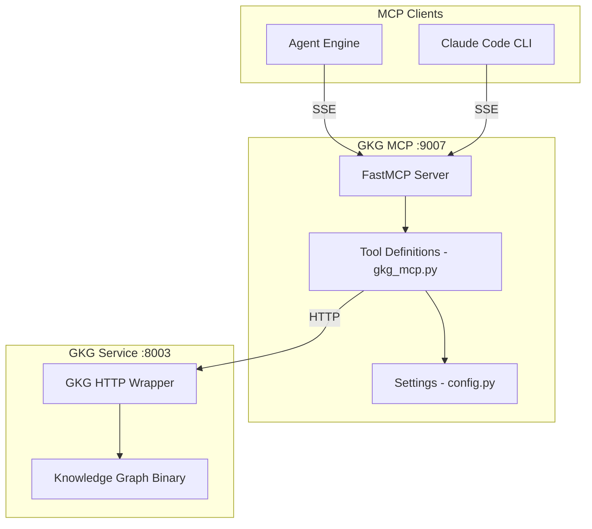
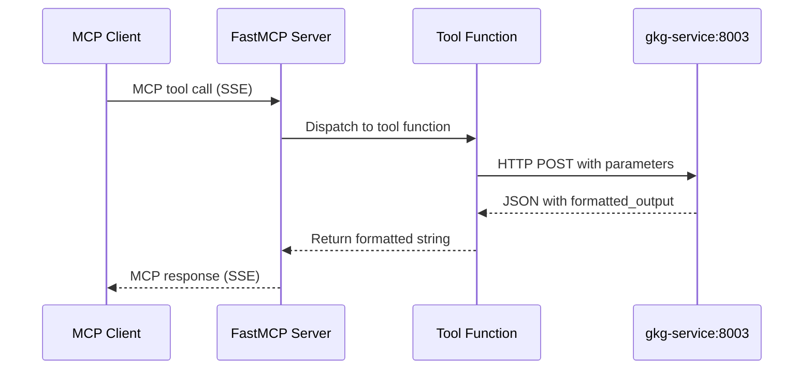

# GKG MCP Architecture

## Overview

The GKG (GitLab Knowledge Graph) MCP server exposes 5 code analysis tools that query the GKG service (port 8003). It provides dependency analysis, symbol usage tracking, call graphs, class hierarchies, and entity relationship queries.

## Design Principles

1. **Thin Wrapper** - No business logic, pure protocol translation
2. **Formatted Output** - Uses GKG service's `formatted_output` for LLM readability
3. **Structured Logging** - JSON-structured logs via structlog
4. **Passthrough Design** - Parameters forwarded directly to backend

## Component Architecture



## Directory Structure

```
gkg-mcp/
├── gkg_mcp.py         # FastMCP server + 5 tool definitions
├── main.py            # Entry point (structlog config + server start)
├── config.py          # Settings (gkg_url, mcp_port, log_level)
├── requirements.txt   # Runtime deps
└── Dockerfile
```

## Data Flow

### Tool Invocation Flow



## API Endpoint Mapping

| Tool | HTTP Method | Backend Endpoint |
|------|-------------|-----------------|
| `analyze_dependencies` | POST | `/analyze/dependencies` |
| `find_usages` | POST | `/query/usages` |
| `get_call_graph` | POST | `/graph/calls` |
| `get_class_hierarchy` | POST | `/graph/hierarchy` |
| `get_related_entities` | POST | `/graph/related` |

## Output Formatting

- `analyze_dependencies`: Returns `formatted_output` from GKG service (dependency tree)
- `find_usages`: Self-formats: `## Usages of \`symbol\`` with file:line entries
- `get_call_graph`: Returns `formatted_graph` from GKG service (call tree)
- `get_class_hierarchy`: Returns `formatted_hierarchy` from GKG service
- `get_related_entities`: Self-formats: groups by relationship type with entity details

## Testing Strategy

Tests focus on **behavior**, not implementation:

- "analyze_dependencies returns dependency tree for given file"
- "find_usages returns file locations for symbol"
- "get_call_graph returns callers and callees"
- Uses `respx` to mock HTTP calls to gkg-service

## Integration Points

### With Agent Engine
```
Agent Engine --> SSE /sse --> GKG MCP :9007
```

### With GKG Service
```
GKG MCP --> HTTP --> gkg-service:8003 --> Knowledge Graph Binary
```
