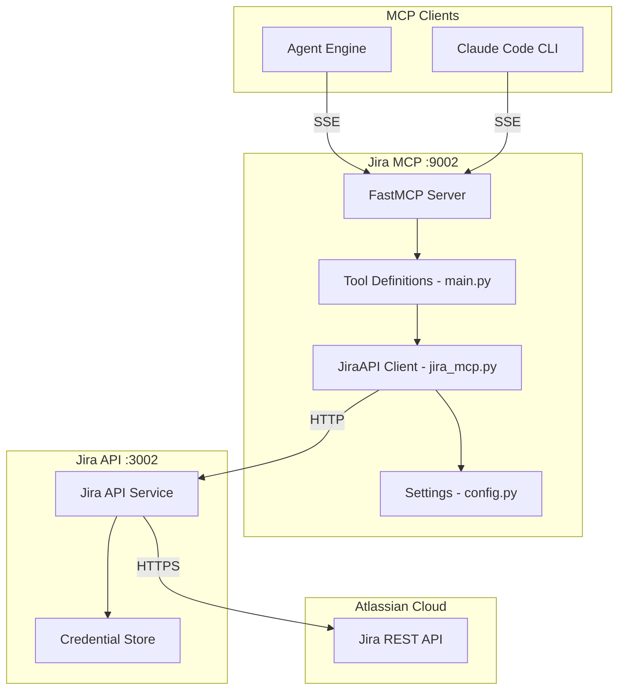
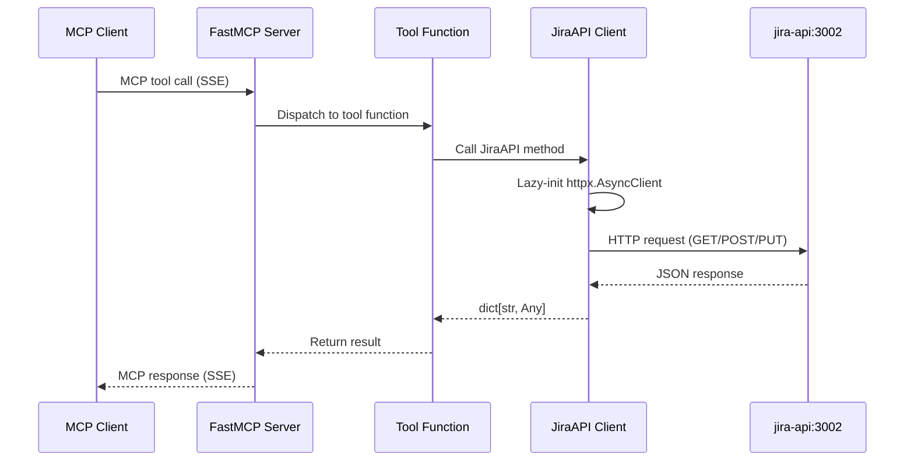

# Jira MCP Architecture

## Overview

The Jira MCP server is a thin protocol translation layer that exposes 10 Jira operations as MCP tools. It delegates all API calls to the Jira API service (port 3002), maintaining credential isolation.

## Design Principles

1. **Thin Wrapper** - No business logic, pure protocol translation
2. **Credential Isolation** - Never stores API keys, delegates to jira-api
3. **Lazy Connection** - HTTP client created on first use, reused across requests
4. **Passthrough Design** - Parameters forwarded directly to backend

## Component Architecture



## Directory Structure

```
jira-mcp/
├── main.py            # FastMCP server + 10 tool registrations
├── jira_mcp.py        # JiraAPI class (HTTP client wrapper)
├── config.py          # Settings via pydantic-settings
├── requirements.txt   # Runtime deps
├── Dockerfile
└── tests/             # respx-based behavior tests
```

## Data Flow

### Tool Invocation Flow



## API Endpoint Mapping

| Tool | HTTP Method | Backend Endpoint |
|------|-------------|-----------------|
| `get_jira_issue` | GET | `/api/v1/issues/{issue_key}` |
| `create_jira_issue` | POST | `/api/v1/issues` |
| `update_jira_issue` | PUT | `/api/v1/issues/{issue_key}` |
| `add_jira_comment` | POST | `/api/v1/issues/{issue_key}/comments` |
| `search_jira_issues` | POST | `/api/v1/search` |
| `get_jira_transitions` | GET | `/api/v1/issues/{issue_key}/transitions` |
| `transition_jira_issue` | POST | `/api/v1/issues/{issue_key}/transitions` |
| `create_jira_project` | POST | `/api/v1/projects` |
| `get_jira_boards` | GET | `/api/v1/boards` |
| `create_jira_board` | POST | `/api/v1/boards` |

## Testing Strategy

Tests focus on **behavior**, not implementation:

- "get_jira_issue returns issue data from backend"
- "create_jira_issue sends correct payload with project_key and summary"
- "search_jira_issues forwards JQL query to backend"
- Uses `respx` to mock HTTP calls to jira-api service

## Integration Points

### With Agent Engine
```
Agent Engine --> SSE /sse --> Jira MCP :9002
```

### With Jira API Service
```
Jira MCP --> HTTP --> jira-api:3002 --> Jira REST API
```
