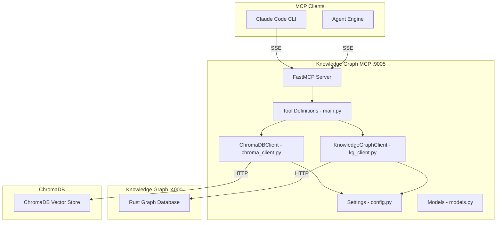
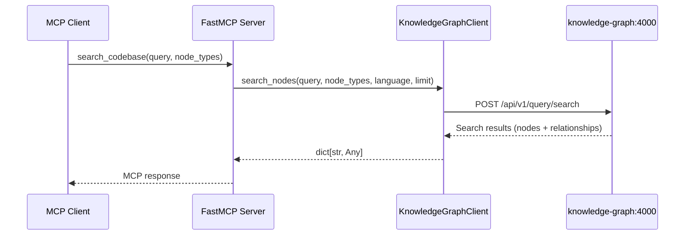
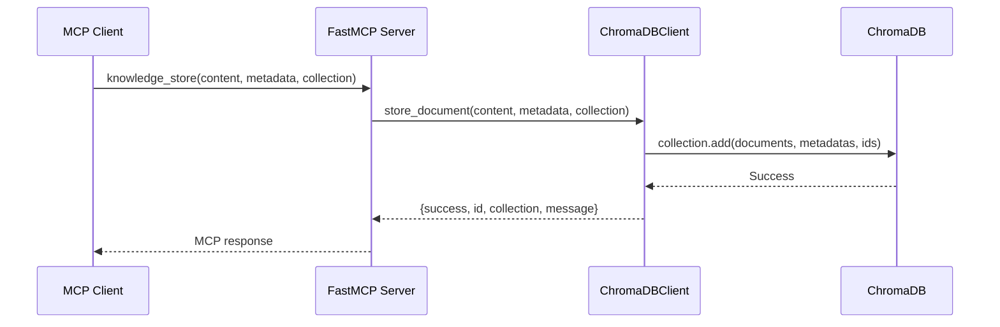

# Knowledge Graph MCP Architecture

## Overview

The Knowledge Graph MCP server exposes 12 tools across two backends: 7 graph query tools via the Knowledge Graph service (port 4000) and 5 vector storage tools via ChromaDB. It provides semantic code search, dependency tracking, and persistent knowledge storage.

## Design Principles

1. **Dual Backend** - Graph queries via Knowledge Graph, vector storage via ChromaDB
2. **Credential Isolation** - No direct database credentials, uses HTTP clients
3. **Lazy Connection** - Both clients created on first use
4. **Passthrough Design** - Parameters forwarded directly to backends

## Component Architecture



## Directory Structure

```
knowledge-graph-mcp/
├── main.py            # FastMCP server + 12 tool registrations
├── kg_client.py       # KnowledgeGraphClient (HTTP to KG service)
├── chroma_client.py   # ChromaDBClient (HTTP to ChromaDB)
├── config.py          # Settings (KG_PORT, KG_KNOWLEDGE_GRAPH_URL)
├── models.py          # Pydantic models for request/response types
├── requirements.txt   # Runtime deps (fastmcp, httpx, chromadb)
├── Dockerfile
└── tools/
    └── __init__.py    # Re-exports: manage_collections, query_knowledge, store_knowledge
```

## Data Flow

### Graph Query Flow



### Vector Store Flow



## API Endpoint Mapping

### Graph Tools (Knowledge Graph :4000)

| Tool | HTTP Method | Backend Endpoint |
|------|-------------|-----------------|
| `search_codebase` | POST | `/api/v1/query/search` |
| `find_symbol_references` | POST | `/api/v1/query/search` |
| `get_code_structure` | POST | `/api/v1/query/search` |
| `find_dependencies` | POST | `/api/v1/query/neighbors` |
| `find_code_path` | POST | `/api/v1/query/path` |
| `get_code_neighbors` | POST | `/api/v1/query/neighbors` |
| `get_graph_stats` | GET | `/api/v1/stats` |

### Vector Tools (ChromaDB)

| Tool | Operation | ChromaDB Method |
|------|-----------|----------------|
| `knowledge_store` | Store document | `collection.add()` |
| `knowledge_query` | Semantic search | `collection.query()` |
| `knowledge_collections` | Manage collections | `list/create/delete_collection()` |
| `knowledge_update` | Update document | `collection.update()` |
| `knowledge_delete` | Delete document | `collection.delete()` |

## ChromaDB Configuration

ChromaDB connection uses environment variables:
- `CHROMA_HOST` (default: `chromadb`)
- `CHROMA_PORT` (default: `8000`)
- Collections use cosine similarity (`hnsw:space: cosine`)

## Testing Strategy

Tests focus on **behavior**, not implementation:

- "search_codebase returns matching code entities"
- "knowledge_store creates document in ChromaDB collection"
- "knowledge_query returns semantically similar documents"
- Graph tests use `respx` to mock Knowledge Graph HTTP calls
- Vector tests mock ChromaDB client methods

## Integration Points

### With Agent Engine
```
Agent Engine --> SSE /sse --> Knowledge Graph MCP :9005
```

### With Knowledge Graph Service
```
Knowledge Graph MCP --> HTTP --> knowledge-graph:4000
```

### With ChromaDB
```
Knowledge Graph MCP --> HTTP --> chromadb:8000
```
