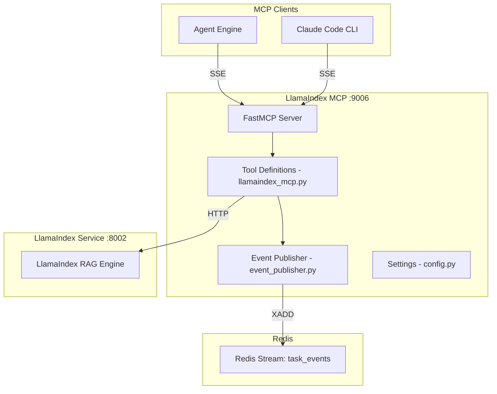
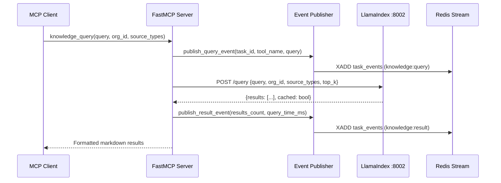

# LlamaIndex MCP Architecture

## Overview

The LlamaIndex MCP server exposes 5 hybrid search tools that query the LlamaIndex service (port 8002) for code, Jira tickets, and Confluence documentation. It includes event publishing to Redis for query observability.

## Design Principles

1. **Hybrid Search** - Combines vector search with graph-based relationships
2. **Event Publishing** - Publishes query/result events to Redis streams for observability
3. **Formatted Output** - Results formatted as markdown for LLM consumption
4. **Multi-Source** - Searches across code, Jira, and Confluence from a single interface

## Component Architecture



## Directory Structure

```
llamaindex-mcp/
├── llamaindex_mcp.py  # FastMCP server + 5 tool definitions
├── main.py            # Entry point (structlog config + server start)
├── config.py          # Settings (llamaindex_url, mcp_port, redis_url)
├── event_publisher.py # Redis stream event publishing
├── requirements.txt   # Runtime deps
└── Dockerfile
```

## Data Flow

### Hybrid Search Flow



## API Endpoint Mapping

| Tool | Backend Endpoint | Description |
|------|-----------------|-------------|
| `knowledge_query` | `POST /query` | Hybrid search across all sources |
| `code_search` | `POST /query/code` | Code-specific search with repo/language filters |
| `find_related_code` | `POST /graph/related` | Graph-based code relationships |
| `search_jira_tickets` | `POST /query/tickets` | Semantic Jira ticket search |
| `search_confluence` | `POST /query/docs` | Confluence documentation search |

## Event Publishing

The event publisher sends query telemetry to Redis streams:

- **Event types**: `knowledge:query`, `knowledge:result`
- **Stream**: `task_events`
- **Condition**: Only publishes when `task_id` is provided and `publish_knowledge_events` is enabled
- **Failure mode**: Logs warning on publish failure, does not block tool response

### Event Data

**Query Event:**
- tool_name, query, org_id, source_types

**Result Event:**
- tool_name, query, results_count, results_preview (top 5), query_time_ms, cached

## Output Formatting

All tools return markdown-formatted strings for LLM readability:

- **knowledge_query**: Results with source type, relevance score, and content preview
- **code_search**: File paths with line ranges and syntax-highlighted code blocks
- **find_related_code**: Grouped by relationship type (calls, imports, extends)
- **search_jira_tickets**: Issue key, status, priority, labels, description preview
- **search_confluence**: Page title, space, last modified, content preview

## Integration Points

### With Agent Engine
```
Agent Engine --> SSE /sse --> LlamaIndex MCP :9006
```

### With LlamaIndex Service
```
LlamaIndex MCP --> HTTP --> llamaindex-service:8002
```

### With Redis
```
LlamaIndex MCP --> XADD --> Redis task_events stream
```
