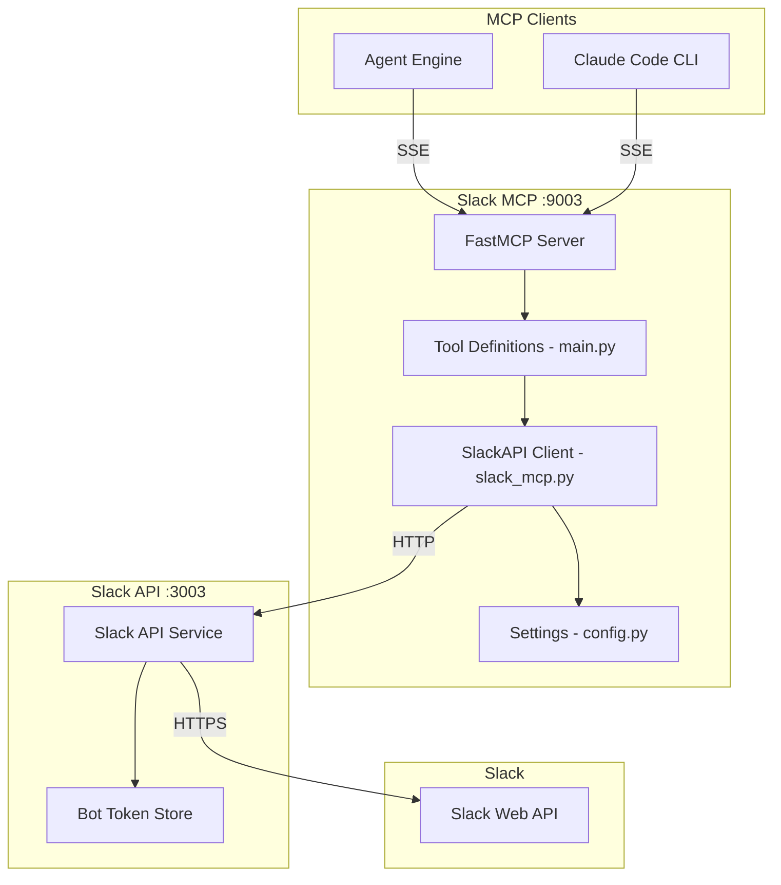
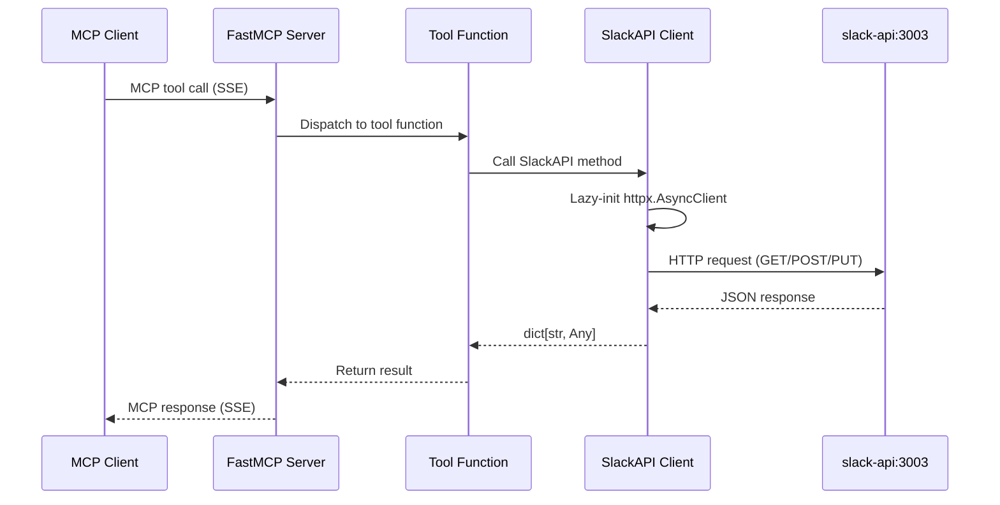

# Slack MCP Architecture

## Overview

The Slack MCP server is a thin protocol translation layer that exposes 8 Slack operations as MCP tools. It delegates all API calls to the Slack API service (port 3003), maintaining credential isolation.

## Design Principles

1. **Thin Wrapper** - No business logic, pure protocol translation
2. **Credential Isolation** - Never stores Slack tokens, delegates to slack-api
3. **Lazy Connection** - HTTP client created on first use, reused across requests
4. **Thread Awareness** - Tools support Slack threading via thread_ts parameter

## Component Architecture



## Directory Structure

```
slack-mcp/
├── main.py            # FastMCP server + 8 tool registrations
├── slack_mcp.py       # SlackAPI class (HTTP client wrapper)
├── config.py          # Settings via pydantic-settings
├── requirements.txt   # Runtime deps
└── Dockerfile
```

## Data Flow

### Tool Invocation Flow



## API Endpoint Mapping

| Tool | HTTP Method | Backend Endpoint |
|------|-------------|-----------------|
| `send_slack_message` | POST | `/api/v1/messages` |
| `get_slack_channel_history` | GET | `/api/v1/channels/{channel}/history` |
| `get_slack_thread` | GET | `/api/v1/channels/{channel}/threads/{thread_ts}` |
| `add_slack_reaction` | POST | `/api/v1/reactions` |
| `get_slack_channel_info` | GET | `/api/v1/channels/{channel}` |
| `list_slack_channels` | GET | `/api/v1/channels` |
| `get_slack_user_info` | GET | `/api/v1/users/{user_id}` |
| `update_slack_message` | PUT | `/api/v1/messages` |

## Testing Strategy

Tests focus on **behavior**, not implementation:

- "send_slack_message sends message with correct channel and text"
- "get_slack_thread returns thread replies"
- "add_slack_reaction forwards emoji to backend"
- Uses `respx` to mock HTTP calls to slack-api service

## Integration Points

### With Agent Engine
```
Agent Engine --> SSE /sse --> Slack MCP :9003
```

### With Slack API Service
```
Slack MCP --> HTTP --> slack-api:3003 --> Slack Web API
```
