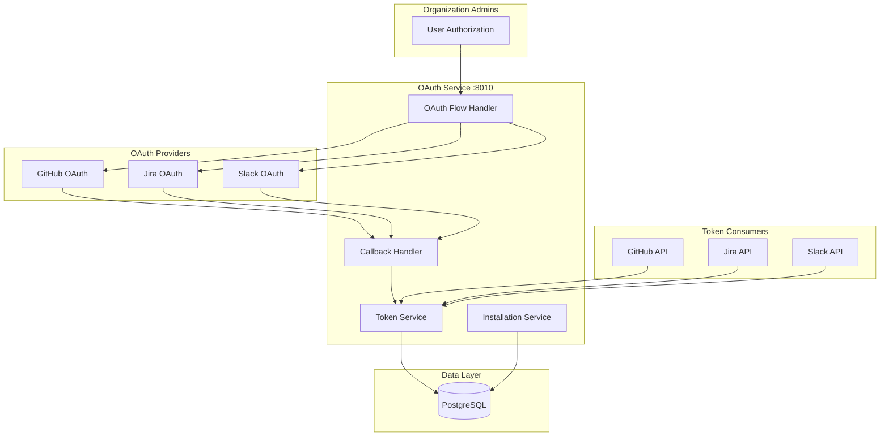
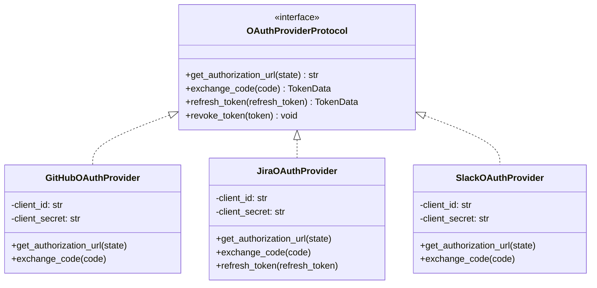
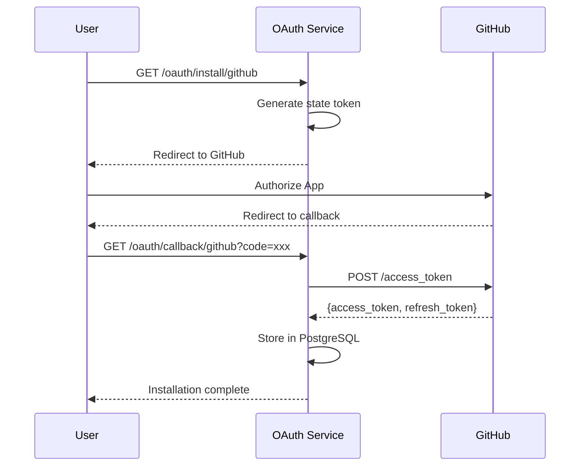
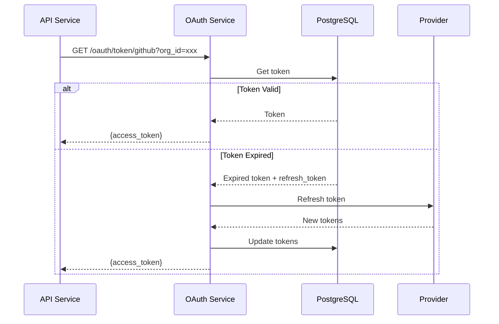
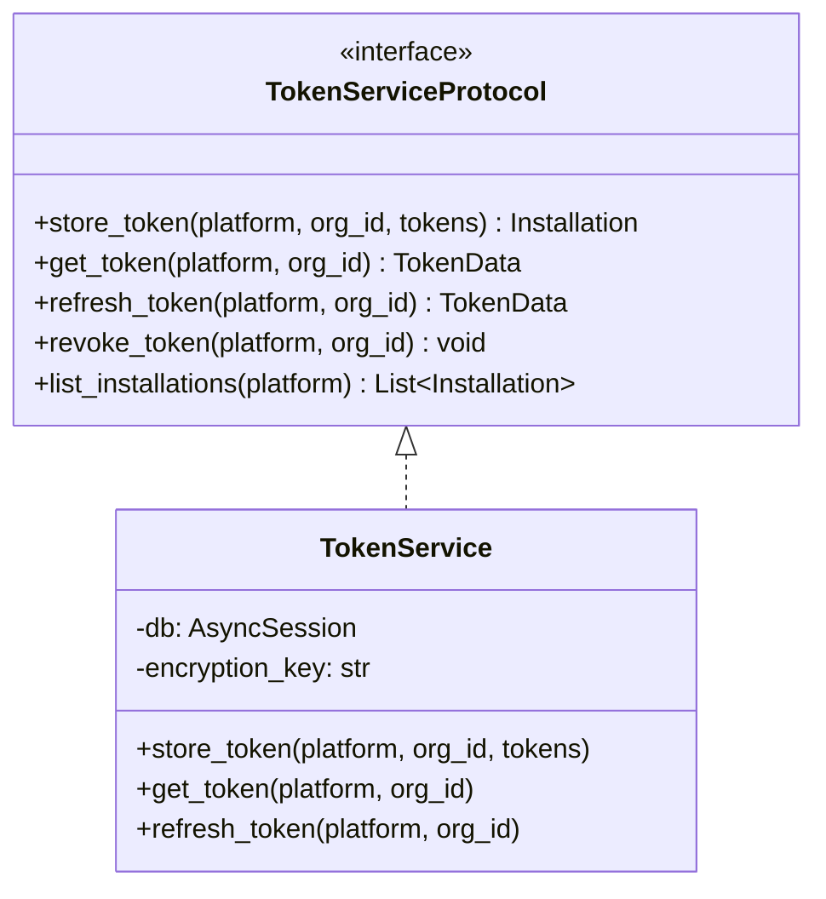
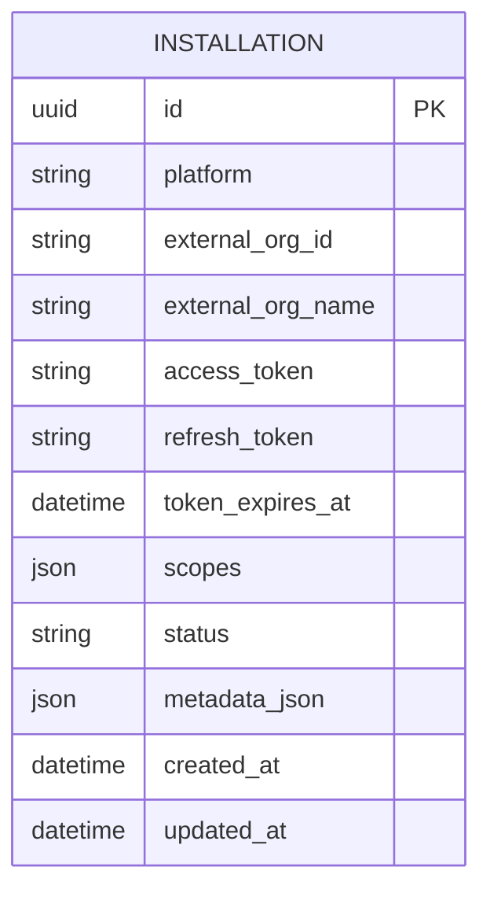
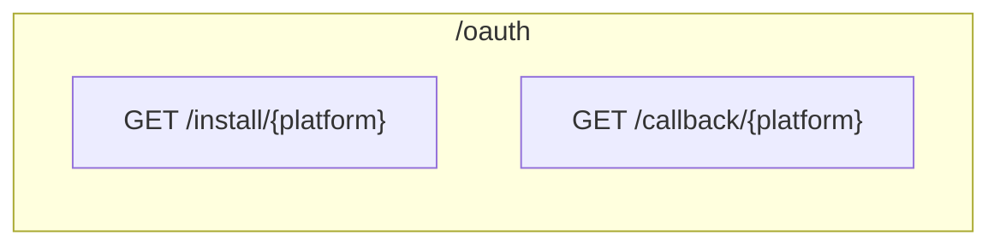
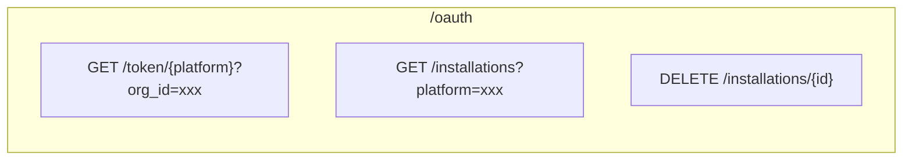
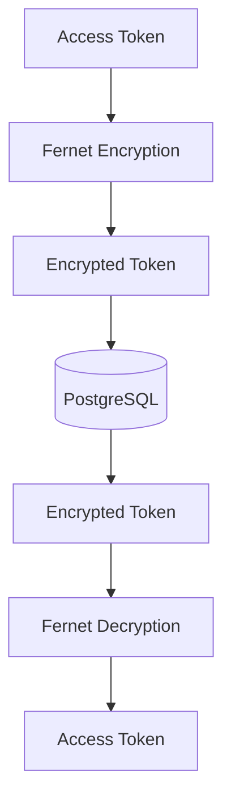

# OAuth Service Architecture

## Overview

The OAuth Service manages OAuth tokens for multi-tenant, organization-level installations. Organizations install the OAuth app once, and all services use organization-level tokens. It handles OAuth flows for GitHub, Jira, and Slack integrations.

## Design Principles

1. **Organization-Level Tokens** - One token per org, not per user
2. **Automatic Refresh** - Handle token expiration transparently
3. **Centralized Management** - Single source of truth for all tokens
4. **Secure Storage** - Encrypted token storage

## Component Architecture



## Directory Structure

```
oauth-service/
├── main.py                    # FastAPI application
├── api/
│   ├── routes.py              # OAuth routes
│   └── server.py              # FastAPI app creation
├── providers/
│   ├── base.py                # Base OAuth provider
│   ├── github.py              # GitHub OAuth provider
│   ├── jira.py                # Jira OAuth provider
│   └── slack.py               # Slack OAuth provider
├── services/
│   ├── token_service.py       # Token storage and refresh
│   └── installation_service.py # Installation management
└── config/
    └── settings.py            # Configuration
```

## OAuth Provider Protocol



## OAuth Flow

### GitHub OAuth Flow



### Token Refresh Flow



## Token Service Protocol



## Data Model



### Installation Status Values

| Status | Description |
|--------|-------------|
| ACTIVE | Token valid and usable |
| EXPIRED | Token expired, needs refresh |
| REVOKED | User revoked access |
| ERROR | Refresh failed |

## API Endpoints

### OAuth Flows



### Token Management



## Security

### Token Encryption



### Webhook Secret vs OAuth Token

| Type | Scope | Purpose |
|------|-------|---------|
| Webhook Secret | App-level | Verify webhook signatures |
| OAuth Token | Org-level | API access per organization |

## Testing Strategy

Tests focus on **behavior**, not implementation:

- ✅ "Store token creates installation record"
- ✅ "Get token returns valid token"
- ✅ "Expired token triggers refresh"
- ❌ "Fernet.encrypt called with correct key"

## Integration Points

### With API Services
```
GitHub API → GET /oauth/token/github?org_id=xxx → OAuth Service
Jira API → GET /oauth/token/jira?org_id=xxx → OAuth Service
Slack API → GET /oauth/token/slack?workspace_id=xxx → OAuth Service
```

### With Dashboard
```
Dashboard → GET /oauth/installations?platform=github → OAuth Service
```
