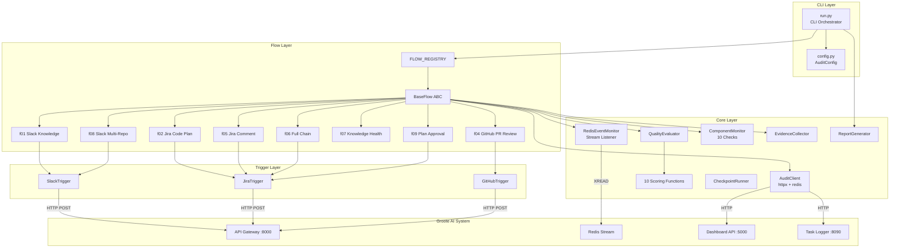
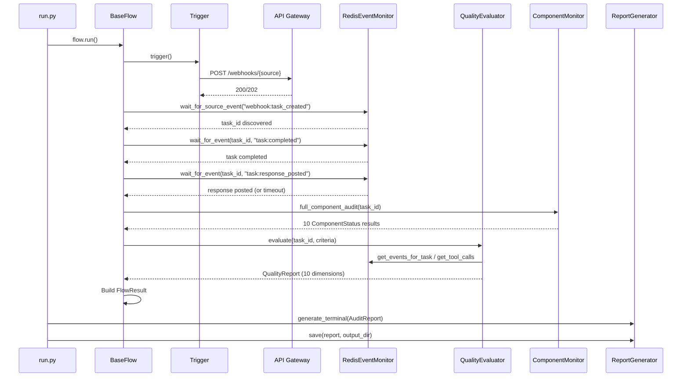

# Audit Framework Architecture

## Overview

The audit framework is an end-to-end system validation tool that fires real webhooks through the groote-ai pipeline and evaluates every component's response. It replaces manual testing with automated, reproducible quality audits across 8 flows, 3 trigger types, 10 quality dimensions, and 10 pipeline components.

## Design Principles

1. **Real Triggers** - Fires actual webhook payloads through the API Gateway, not mocked requests
2. **Full Pipeline** - Verifies every component from webhook reception to platform response delivery
3. **Quality Scoring** - Weighted multi-dimensional scoring with configurable pass thresholds
4. **Evidence Collection** - Saves all events, component checks, and quality reports as JSON artifacts

## Component Architecture



## Directory Structure

```
scripts/audit/
├── __main__.py              # asyncio.run(main()) entry point
├── run.py                   # CLI arg parsing, flow resolution, orchestration
├── config.py                # AuditConfig Pydantic model, env var loading
├── core/
│   ├── client.py            # httpx AsyncClient + redis async client
│   ├── redis_monitor.py     # Redis stream reader with event dispatching
│   ├── evidence.py          # JSON evidence file writer
│   ├── evaluator.py         # Quality evaluation coordinator
│   ├── scoring.py           # 10 scoring dimension implementations
│   ├── models.py            # QualityReport, FlowCriteria, QualityDimension
│   ├── report.py            # AuditReport, FlowReport, terminal/JSON output
│   ├── checkpoint.py        # Sequential checkpoint runner with skip-on-critical
│   └── component_monitor.py # 10 pipeline component health checks
├── flows/
│   ├── __init__.py          # FLOW_REGISTRY dict
│   ├── base.py              # BaseFlow ABC with run() lifecycle
│   └── f01-f09              # Individual flow implementations
└── triggers/
    ├── base.py              # TriggerResult model
    ├── slack.py             # HMAC-signed Slack event payloads
    ├── jira.py              # Jira ticket/comment creation via API service
    └── github.py            # GitHub issue/PR creation via API service
```

## Data Flow

### Audit Execution Pipeline



## Key Models

### FlowCriteria

Defines expected behavior for quality evaluation:

```json
{
    "expected_agent": "slack-inquiry",
    "required_tools": ["knowledge_query"],
    "required_response_tools": ["send_slack_message"],
    "required_output_patterns": ["manga-creator"],
    "domain_terms": ["architecture", "feature", "component"],
    "negative_terms": ["groote-ai"],
    "target_repo": "manga-creator",
    "min_output_length": 200,
    "max_execution_seconds": 180.0,
    "requires_knowledge": true
}
```

### TriggerResult

Output from firing a real trigger:

```json
{
    "platform": "slack",
    "artifact_type": "message",
    "artifact_id": "1707924123.abc123",
    "trigger_time": "2026-02-14T10:00:00Z",
    "expected_flow_id": "slack:C0A9D3BFK2P:1707924123.abc123",
    "raw_response": {}
}
```

### QualityReport

Quality evaluation result:

```json
{
    "task_id": "uuid",
    "dimensions": [
        {"name": "Routing Accuracy", "score": 100, "detail": "Correctly routed to slack-inquiry"}
    ],
    "overall_score": 85,
    "passed": true,
    "suggestions": []
}
```

## Integration Points

### With API Gateway
```
Triggers -> POST /webhooks/{slack,jira,github} -> API Gateway
```

### With Redis
```
RedisEventMonitor -> XREAD task_events stream -> Event dispatching
AuditClient -> redis.delete (dedup key clearing)
```

### With Dashboard API
```
AuditClient -> GET /api/conversations/by-flow/{flow_id} -> Conversation verification
AuditClient -> GET /api/conversations/{id}/messages -> Message verification
```

### With Task Logger
```
AuditClient -> GET /tasks/{task_id}/logs -> Log verification
```

## Testing Strategy

The flows ARE the tests. The framework validates correctness through real end-to-end execution:

- "Slack knowledge query routes to slack-inquiry agent"
- "Jira code plan uses knowledge tools before responding"
- "Response is posted back to originating platform via MCP"
- "All 10 pipeline components report healthy"
