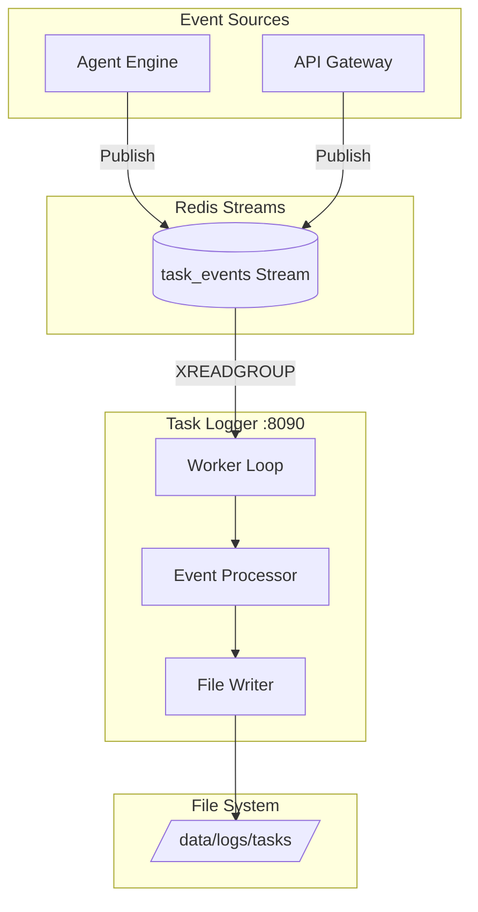
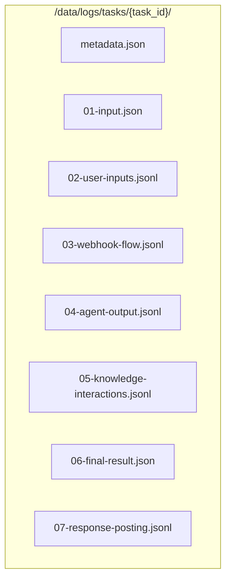
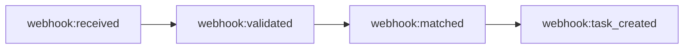
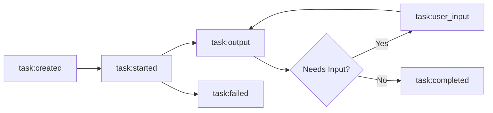
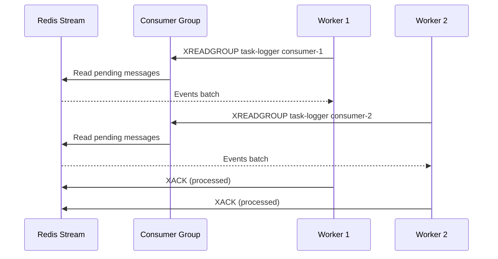
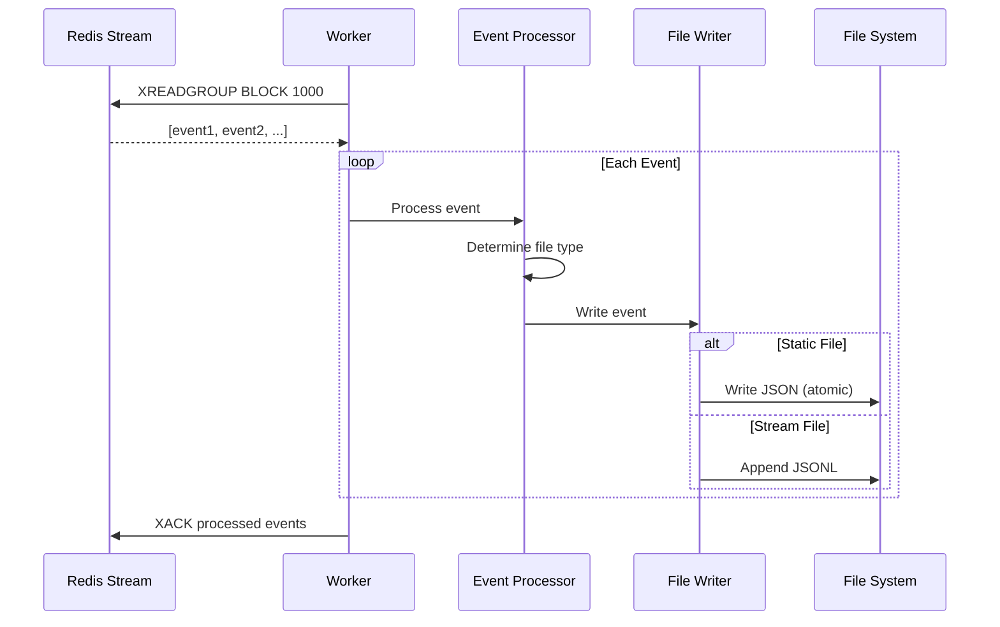
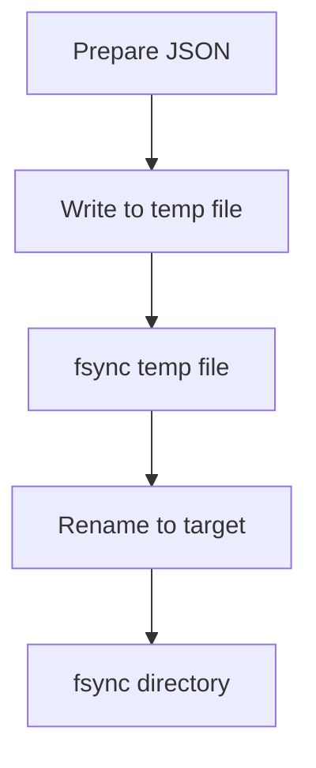
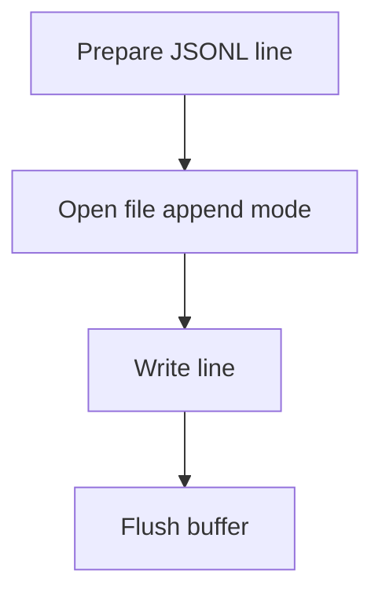
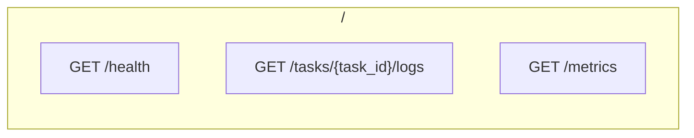
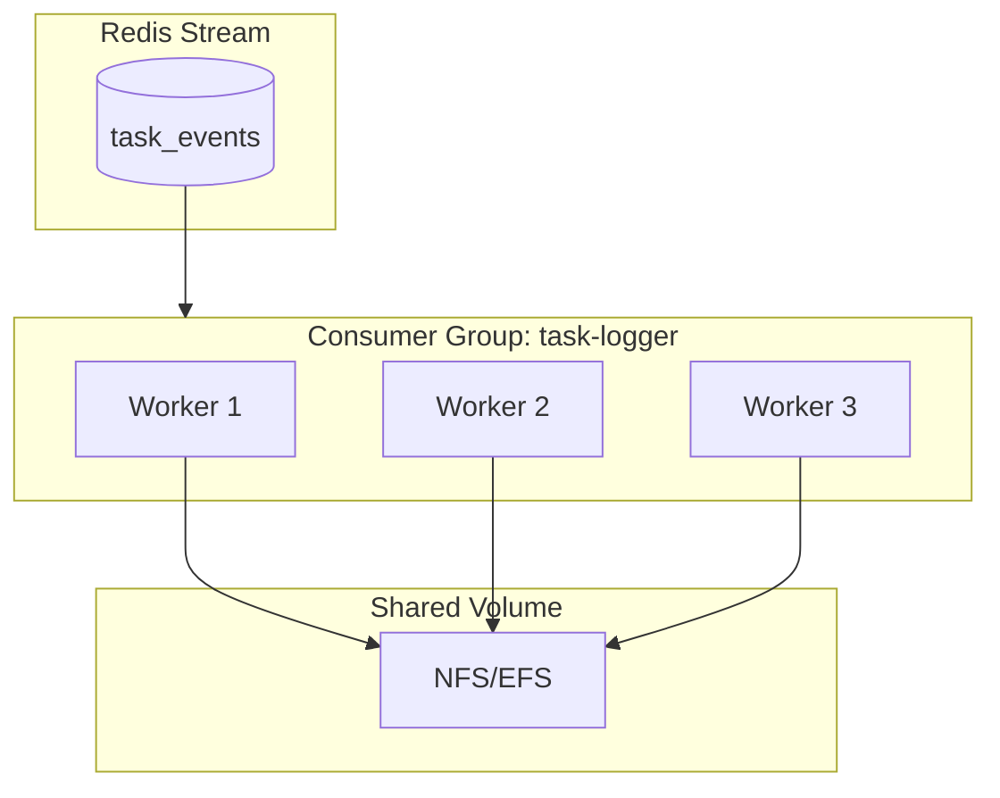

# Task Logger Architecture

## Overview

The Task Logger is a dedicated microservice for structured task logging. It consumes task events from Redis stream and writes structured log files for each task, enabling audit trails and debugging.

## Design Principles

1. **Event Sourcing** - All task events captured in sequence
2. **Structured Logs** - Each task gets organized directory structure
3. **Reliable Delivery** - Redis streams with consumer groups
4. **Atomic Writes** - Temp file + rename for crash safety

## Component Architecture



## Directory Structure

```
task-logger/
├── main.py              # FastAPI app + Redis consumer
├── worker.py            # Event processing worker
├── logger.py            # File logging utilities
├── models.py            # Pydantic models
├── models/
│   └── knowledge_events.py # Knowledge event models
├── config.py            # Settings
└── tests/
    ├── conftest.py      # Shared fixtures
    └── test_*.py        # Test files
```

## Log Directory Structure



### File Descriptions

| File | Type | Content |
|------|------|---------|
| metadata.json | Static | Task ID, source, agent type |
| 01-input.json | Static | Initial task input/prompt |
| 02-user-inputs.jsonl | Stream | User interactive inputs |
| 03-webhook-flow.jsonl | Stream | Webhook processing events |
| 04-agent-output.jsonl | Stream | Claude output, tool calls |
| 05-knowledge-interactions.jsonl | Stream | Knowledge service queries/results |
| 06-final-result.json | Static | Final results + metrics |
| 07-response-posting.jsonl | Stream | Response posting events |

## Event Types

### Webhook Events



### Task Events



## Redis Consumer Architecture



## Event Processing Flow



## File Write Strategy

### Atomic Writes (Static Files)



### Append Writes (Stream Files)



## Event Models

### Task Created Event

```json
{
    "event_type": "task:created",
    "task_id": "uuid",
    "timestamp": "2026-01-31T12:00:00Z",
    "data": {
        "source": "github",
        "agent_type": "github-issue-handler",
        "prompt": "Fix the authentication bug"
    }
}
```

### Task Output Event

```json
{
    "event_type": "task:output",
    "task_id": "uuid",
    "timestamp": "2026-01-31T12:00:01Z",
    "data": {
        "content_type": "text",
        "content": "Analyzing the codebase..."
    }
}
```

### Task Completed Event

```json
{
    "event_type": "task:completed",
    "task_id": "uuid",
    "timestamp": "2026-01-31T12:05:00Z",
    "data": {
        "status": "completed",
        "cost_usd": 0.05,
        "input_tokens": 1000,
        "output_tokens": 500,
        "duration_seconds": 300
    }
}
```

## API Endpoints



## Metrics

| Metric | Description |
|--------|-------------|
| queue_depth | Pending events in stream |
| events_processed | Total events processed |
| events_failed | Failed event count |
| processing_rate | Events per second |
| disk_usage | Log directory size |

## Scaling Model



## Testing Strategy

Tests focus on **behavior**, not implementation:

- ✅ "Task created event creates metadata.json"
- ✅ "Task output events append to agent-output.jsonl"
- ✅ "Atomic write survives crash"
- ❌ "os.rename called after fsync"

## Integration Points

### With Agent Engine
```
Agent Engine → XADD task_events → Redis → Task Logger
```

### With API Gateway
```
API Gateway → XADD task_events → Redis → Task Logger
```
